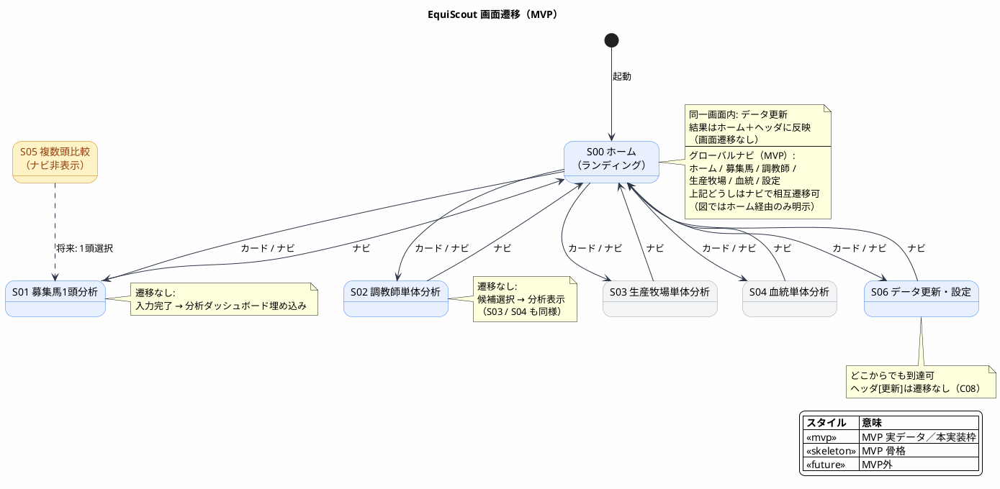

# EquiScout 画面設計書（情報設計）

| 項目 | 内容 |
|------|------|
| 対象プロダクト | EquiScout |
| 根拠ドキュメント | [`requirement.md`](../01_requirement/requirement.md) / [`architecture.md`](./architecture.md) |
| 関連設計 | [`DB_design.md`](./DB_design.md) / [`base_desing.md`](./base_desing.md) |
| レイアウト・ビジュアル | [`UI/`](./UI/README.md)（画面・パネル単位） |
| 参考 | [AIで画面設計を整える｜ワイヤーフレームからBubble実装まで](https://note.com/john01/n/nd4da0d5f8841)（情報設計・レイアウト・ビジュアルの3層） |
| 作成日 | 2026-07-26 |
| 更新日 | 2026-08-09 |
| 対象フェーズ | MVP（調教師本実装）＋将来拡張の画面骨格 |

---

## 目次

1. [本書の目的と進め方](#1-本書の目的と進め方)
2. [第1層：情報設計](#2-第1層情報設計)
3. [MVP 完了条件・対応表](#3-mvp-完了条件対応表)
4. [未決・委譲・まとめ](#4-未決委譲まとめ)

---

## 1. 本書の目的と進め方

### 1.1 目的

要求の操作フロー（ホーム入口 / 1頭分析 / 単体分析 / 将来の複数頭比較）と、アーキテクチャ上の Presentation コンポーネント（C01〜C08）を対応づけ、**何を載せるか**を定める。

画面設計を「1枚の絵」として扱わず、次の **3層をこの順で確定** する（[参考記事](https://note.com/john01/n/nd4da0d5f8841)）。

| 層 | 決めること | 置き場 |
|----|------------|--------|
| **1. 情報設計** | 何を載せるか、優先順位、載せないもの、ゴール | **本書（正本。人が握る）** |
| **2. レイアウト** | どこに置くか、読む順序、パネル／ワイヤ | [`UI/`](./UI/README.md)（画面・パネル単位） |
| **3. ビジュアル** | 配色・フォント・余白・トーン | [`UI/`](./UI/README.md) ＋ トークンは [`base_desing.md`](./base_desing.md) |

### 1.2 設計方針（横断）

| # | 方針 | 根拠 |
|---|------|------|
| 1 | **ホームページを起動時ランディング**とし、分析画面・設定・データ更新への入口を集約する | 要求 3.1・6 / 本書 S00 |
| 2 | **分析ダッシュボードを共通枠**とし、分析種類は切替で埋め込む | 要求 3.1 / アーキ C03 |
| 3 | **調教師分析ビューは単体画面とダッシュボード埋め込みで共用**する | 要求 3.1・3.3 / C04 |
| 4 | MVP は調教師を実データ、牧場・血統・類似馬は骨格／プレースホルダ | 要求 4 MVP |
| 5 | 募集馬は **画面先行**（フォーム状態のみ。永続化は後続） | アーキ 6.3 |
| 6 | 表示は分析済みデータの読取のみ。重い集計は UI で行わない | アーキ Presentation |
| 7 | 強さ・コスパ・複数頭ランキングは **載せない**（MVP） | 要求 4 / feature flag |
| 8 | UI 言語は日本語。デスクトップ（のち Electron）前提 | 要求 6 / アーキ 9.1 |

### 1.3 用語（画面の分解単位）

| 単位 | 意味 | 例 |
|------|------|-----|
| **画面 (Screen)** | ナビで遷移する単位 | ホーム、調教師単体分析 |
| **パネル (Panel)** | 画面内の役割が1つの区画 | 検索、賞金サマリ、遷移カード |
| **コンポーネント** | 再利用可能な UI 塊 | `EntitySearchBox`、`MetricTable`、`NavCard` |
| **UI要素** | 入力・表示の最小単位 | テキストフィールド、表セル |

配置・見た目の詳細は [`UI/`](./UI/README.md) 側の用語・部品カタログを参照する。

### 1.4 情報設計の書き方（各画面共通）

各画面は次の4点を必須とする（参考記事の型）。

1. **役割**（一文）
2. **載せる要素**（上から優先順位順）
3. **載せない要素**
4. **ゴール**（読まれたい情報 / 押されたい操作）

---

## 2. 第1層：情報設計

> 「この画面に何を載せるか、どの優先順位で載せるか」を決める層。  
> レイアウトや見た目より先に、ここを確定する。

### 2.1 画面インベントリとナビ上の優先

| 優先 | ID | 画面名 | MVP | 備考 | レイアウト・ビジュアル |
|------|-----|--------|-----|------|------------------------|
| 1（入口） | S00 | ホーム | ○ | 起動時ランディング。分析・設定への遷移とデータ更新 | [`UI/S00_home.md`](./UI/S00_home.md) |
| 2（本線） | S02 | 調教師単体分析 | ○ 実データ | 分析の本実装 | [`UI/S02_trainer.md`](./UI/S02_trainer.md) |
| 3 | S01 | 募集馬1頭分析 | ○ | ダッシュボード埋め込みで調教師を共用 | [`UI/S01_horse.md`](./UI/S01_horse.md) |
| 4 | S06 | データ更新・設定 | ○ | 全画面から到達。詳細設定はここ | [`UI/S06_settings.md`](./UI/S06_settings.md) |
| 5 | S03 | 生産牧場単体分析 | ○ 骨格 | 導線のみ確保 | [`UI/S03_farm.md`](./UI/S03_farm.md) |
| 6 | S04 | 血統単体分析 | ○ 骨格 | 導線のみ確保 | [`UI/S04_pedigree.md`](./UI/S04_pedigree.md) |
| — | S05 | 複数頭比較 | × | ナビに出さない | [`UI/S05_compare.md`](./UI/S05_compare.md) |

```text
ナビに出す（MVP）: ホーム / 募集馬 / 調教師 / 生産牧場 / 血統 / 設定
ナビに出さない: 複数頭比較、強さ・コスパ専用画面
```

### 2.2 画面遷移（情報の流れ）

同一内容の単体ファイル: [`UI/screen_transition.puml`](./UI/screen_transition.puml)



### 2.3 S00 ホーム（起動時ランディング）

| 項目 | 内容 |
|------|------|
| **役割** | アプリの入口として、各分析画面・設定への遷移と、データの手動更新を行う |
| **ゴール** | ① 行きたい分析（または設定）へすぐ遷移する ② 「データを更新」を実行し、最終更新が分かる |

**載せる要素（優先順）**

1. アプリ／画面の短い案内（何ができるかの一文程度）
2. **分析への遷移**（優先順どおり）  
   - 調教師単体分析（S02）… 本線・実データ  
   - 募集馬1頭分析（S01）  
   - 生産牧場単体分析（S03）… 骨格  
   - 血統単体分析（S04）… 骨格  
3. **設定への遷移**（S06）
4. **データ更新**  
   - 「データを更新」実行  
   - 最終更新日時  
   - 更新中の進捗／直近の成功・失敗の短い結果（詳細は S06 でも可）

**載せない要素（MVP）**

- 分析本体（検索・指標表・ダッシュボード埋め込み）— 各分析画面の責務
- PG 接続の詳細フォーム — S06 の責務（ホームからは設定へ誘導）
- 複数頭比較・強さ／コスパへの導線
- 最近見た対象の履歴一覧（P1 以降で検討可）

**対応アーキ / UC:** C01（シェル状態） / C08 の更新起動・状態読取（`updateFromPostgres` / `getUpdateStatus`）。遷移先は各 Screen。

**配置・見た目:** [`UI/S00_home.md`](./UI/S00_home.md)

### 2.4 S02 調教師単体分析（MVP 本線）

| 項目 | 内容 |
|------|------|
| **役割** | 馬入力なしで調教師を選び、成績指標を読んで比較材料にする |
| **ゴール** | ① 名前で候補を選ぶ ② 賞金・着回・率・距離・重賞を上から読む |

**載せる要素（優先順）**

1. 調教師名の検索（テキスト）と候補一覧
2. 選択中の調教師名（対象の確認）
3. 賞金（本年 / 前年 / 累計 × 本賞金・付加賞金）
4. 着回数（本年 / 前年 / 累計 × 1〜5着・着外）
5. 勝率・連対率・複勝率（本年 / 前年 / 累計）
6. 距離別着回数（芝 / ダート × 距離帯）
7. 最近の重賞勝利一覧

**載せない要素（MVP）**

- 勝率ランキング一覧からの選択
- 多年推移グラフ、クラス別・新馬・勝ち上がり（P1）
- 強さ / コスパスコア
- 募集馬フォーム（S01 の責務）

**対応アーキ / UC:** C04 / `searchTrainers` / `getTrainerAnalysis`

**配置・見た目:** [`UI/S02_trainer.md`](./UI/S02_trainer.md)

### 2.5 S01 募集馬1頭分析

| 項目 | 内容 |
|------|------|
| **役割** | 募集馬の必須属性を入力し、同一画面で分析種類を切り替えて読む |
| **ゴール** | ① 必須入力を完了して「分析を表示」 ② 調教師分析（実データ）を同一画面で確認 |

**載せる要素（優先順）**

1. 必須プロフィール: 生年月日、性別、毛色、体重（募集時・手入力）
2. 血統キー: 母名、父名（候補選択）
3. 関係者: 調教師、生産牧場、産地、馬主
4. 価格: 市場取引価格（主）。1口価格・口数は任意の補助
5. アクション: 「分析を表示」／「クリア」
6. 分析ダッシュボード: 分析種類切替 ＋ 埋め込み本体  
   - 優先して読ませる: **調教師分析（実データ）**  
   - 枠として載せる: 生産牧場 / 血統 / 類似馬（骨格・プレースホルダ）

**載せない要素（MVP）**

- 募集馬の保存・下書き一覧（後続）
- 強さ・コスパ総合評価タブ
- 複数頭入力

**対応アーキ:** C02 + C03（埋め込み C04〜C07）

**配置・見た目:** [`UI/S01_horse.md`](./UI/S01_horse.md) / ダッシュボード [`UI/analysis_dashboard.md`](./UI/analysis_dashboard.md)

### 2.6 分析ダッシュボード（共通・情報設計）

S01（および将来の比較からの遷移）で共用する「分析の中身」の優先と除外。

| 優先 | moduleId | ラベル | MVP で載せるか | 中身の方針 |
|------|----------|--------|----------------|------------|
| 1 | `trainer` | 調教師分析 | ○ | S02 と同じ指標一式（実データ） |
| 2 | `farm` | 生産牧場分析 | ○ 枠 | 準備中＋将来内容の明示 |
| 3 | `pedigree` | 血統分析 | ○ 枠 | 同上（SMILE・馬場・兄弟は後続） |
| 4 | `similarity` | 類似馬・参考成績 | ○ 枠 | 条件未定（PoC）のプレースホルダ |
| — | `strength_cost` | 強さ・コスパ総合 | **載せない** | PoC 後 |

調教師埋め込み時に載せる指標の優先順は **S02 の載せる要素 2〜7 と同一**（再利用）。

**配置・見た目:** [`UI/analysis_dashboard.md`](./UI/analysis_dashboard.md)

### 2.7 S03 生産牧場単体分析（骨格）

| 項目 | 内容 |
|------|------|
| **役割** | 生産者＝牧場を単体で調べる導線を確保する（本実装は後続） |
| **ゴール** | 牧場を選べること。中身は「準備中」で将来範囲が分かること |

**載せる要素（優先順）**

1. 牧場名検索と候補
2. プレースホルダ（将来: 本年/累計の賞金・着回数、出身馬リスト）

**載せない要素（MVP）:** 実集計表、出身馬一覧の本実装

**配置・見た目:** [`UI/S03_farm.md`](./UI/S03_farm.md)

### 2.8 S04 血統単体分析（骨格）

| 項目 | 内容 |
|------|------|
| **役割** | 血統を単体で調べる導線を確保する（本実装は後続） |
| **ゴール** | 父・母などのキーを入れられること。中身は将来範囲が分かること |

**載せる要素（優先順）**

1. 父名・母名などのキー入力（候補）
2. プレースホルダ（将来: 距離適性 SMILE / 馬場適性 / 兄弟成績）

**載せない要素（MVP）:** SMILE 本集計、兄弟成績表の本実装

**配置・見た目:** [`UI/S04_pedigree.md`](./UI/S04_pedigree.md)

### 2.9 S05 複数頭比較（MVP外）

| 項目 | 内容 |
|------|------|
| **役割** | （将来）複数頭を入力し強さ・コスパでランキングする |
| **ゴール** | —（MVP 対象外） |

**載せない（MVP）:** 画面自体をナビに出さない。ルートを生やす場合も Empty のみ。

将来の載せる要素案: 複数頭リスト → ランキング表 → 1頭選択でダッシュボード。

**配置・見た目:** [`UI/S05_compare.md`](./UI/S05_compare.md)

### 2.10 S06 データ更新・設定

| 項目 | 内容 |
|------|------|
| **役割** | JV-DL 正本から手動更新し、接続と更新結果を確認する |
| **ゴール** | 「データを更新」を実行し、成功/失敗と最終更新日時が分かること |

**載せる要素（優先順）**

1. 更新実行と進捗（Sync / Analyze）
2. 結果サマリ（件数・所要時間・エラー）
3. 最終更新日時（シェルにも同一情報を出す）
4. PG 接続設定（ローカルのみ）
5. （任意）SQLite パスの読取表示

**載せない要素:** クラウド同期、定期更新の必須 UI、マルチユーザー認証

**S00 との分担:** ホームは「更新の起動・最終更新・短い結果」まで。接続設定・詳細結果サマリは S06。更新ユースケース自体は同一（C08）。

**対応アーキ / UC:** C08 / `updateFromPostgres` / `getUpdateStatus`

**配置・見た目:** [`UI/S06_settings.md`](./UI/S06_settings.md)

### 2.11 状態として伝える情報（全画面共通）

載せる「状態メッセージ」の優先。見た目は [`UI/visual.md`](./UI/visual.md)。

| 優先 | 状態 | 伝えること |
|------|------|------------|
| 1 | 未選択 | 次に何をすればよいか |
| 2 | エラー | 失敗理由と、可能なら再試行 |
| 3 | 更新中 | 進行中である（操作は継続可） |
| 4 | 読取中 / 検索中 | 待ちであること |
| 5 | 0件 | 候補なし・重賞なし等 |
| 6 | 未実装モジュール | 準備中＋将来載せる内容 |

S01 バリデーション: 必須欠落は「分析を表示」時にフィールド単位で伝える。  
S00: 遷移先が未実装骨格でも「準備中」ではなく、遷移後の画面で伝える（ホームのカードは常に遷移可能）。

### 2.12 表示データの意味ルール（情報の解釈）

UI は生カラムではなく解釈済み値を受ける（アーキ 8.2）。情報として揃えるルール:

| 項目 | ルール |
|------|--------|
| 金額 | 千円区切り＋「円」（換算は ViewModel 側で完了） |
| 率 | `%`。小数桁は全画面統一 |
| 着回数 | 整数。ゼロは `0` |
| 日付 | `YYYY-MM-DD` |
| 最終更新 | `YYYY-MM-DD HH:mm`（ローカル） |
| 欠損 | 「—」または「データなし」 |

---

## 3. MVP 完了条件・対応表

### 3.1 情報設計の完了条件

| 条件 | 状態 |
|------|------|
| S00 に分析・設定への遷移とデータ更新がある | 必須 |
| S02 の載せる要素 1〜7 が欠けない | 必須 |
| S01 必須入力＋ダッシュボードに調教師実データ | 必須 |
| S03/S04/類似は枠。S05・スコアは非表示 | 必須 |

レイアウト・ビジュアルの完了条件は [`UI/README.md`](./UI/README.md) を参照。

### 3.2 再利用マトリクス（調教師・情報）

| 載せる内容 | S02 | S01（trainer） |
|------------|-----|----------------|
| 選択中の調教師名 | ○ | ○（省略可） |
| 賞金 / 着回 / 率 / 距離 / 重賞 | ○ | ○ |

配置上の再利用は [`UI/panels/P-S02-B_trainer_analysis.md`](./UI/panels/P-S02-B_trainer_analysis.md)。

### 3.3 アーキコンポーネント対応（情報設計視点）

| 画面/責務 | アーキ ID | ユースケース |
|-----------|-----------|--------------|
| AppShell | C01 | `getUpdateStatus` |
| HomeScreen（S00） | C01 + C08 | 遷移ナビ / `updateFromPostgres` / `getUpdateStatus` |
| HorseEntryPanel | C02 | MVP: local state（後続 `saveHorse`） |
| AnalysisDashboard | C03 | `listAnalysisModules` / `getAnalysis` |
| TrainerAnalysisView | C04 | `getTrainerAnalysis` |
| FarmAnalysisView | C05 | 後続 |
| PedigreeAnalysisView | C06 | 後続 |
| SimilarityPanel | C07 | 後続 |
| DataUpdateUI（S06 / ホーム更新） | C08 | `updateFromPostgres` / `getUpdateStatus` |
| 調教師検索 | — | `searchTrainers` |

---

## 4. 未決・委譲・まとめ

### 4.1 未決・委譲

| 項目 | 委譲先 |
|------|--------|
| レイアウト（配置・ワイヤ） | [`UI/`](./UI/README.md) |
| ビジュアル方針 | [`UI/visual.md`](./UI/visual.md) |
| 色・フォント・スペーシングのトークン | `base_desing.md` |
| 金額・率の小数・距離帯ラベル | DB / ViewModel |
| チャートライブラリ | アーキ 7.1（実装時） |
| 募集馬保存後の一覧画面 | MVP 後（C10） |
| 設定: 独立画面 vs モーダル | 実装時（ホームからは S06 相当へ到達できれば可） |
| ホーム: 最近見た対象の履歴 | P1 以降 |
| SMILE 境界・類似定義 | Pedigree / PoC |

### 4.2 まとめ

本書は **情報設計のみ** を正本とする。S00 を起動入口、S02 を分析本線に「載せる／載せない／ゴール」を固定する。配置と見た目は [`UI/`](./UI/README.md) の画面・パネル文書に落とし、トークンは `base_desing.md` に委譲する。実装時は情報設計を上書きしない。
