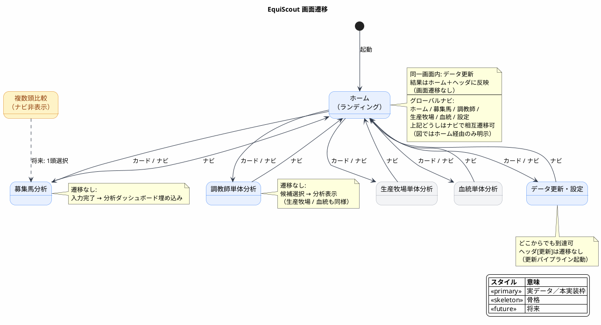

# EquiScout 画面設計書（情報設計）

| 項目 | 内容 |
|------|------|
| 対象プロダクト | EquiScout |
| 根拠ドキュメント | [`requirement.md`](../01_requirement/requirement.md) / [`architecture.md`](./architecture.md) |
| 関連設計 | [`DB_design.md`](./DB_design.md) / [`base_desing.md`](./base_desing.md) |
| レイアウト・ビジュアル | [`UI/`](./UI/README.md)（画面・パネル単位） |
| 参考 | [AIで画面設計を整える｜ワイヤーフレームからBubble実装まで](https://note.com/john01/n/nd4da0d5f8841)（情報設計・レイアウト・ビジュアルの3層） |
| 作成日 | 2026-07-26 |
| 更新日 | 2026-08-09 |

---

## 目次

1. [本書の目的と進め方](#1-本書の目的と進め方)
2. [第1層：情報設計](#2-第1層情報設計)
3. [対応表](#3-対応表)
4. [まとめ](#4-まとめ)

---

## 1. 本書の目的と進め方

### 1.1 目的

要求の操作フロー（ホーム入口 / 1頭分析 / 単体分析 / 将来の複数頭比較）と、アーキテクチャの **Presentation 層**（画面・ナビ・フォーム・チャート描画）の責務を対応づけ、**何を載せるか**を定める。主要コンポーネント一覧は [`base_desing.md`](./base_desing.md) に委譲する。

画面設計を「1枚の絵」として扱わず、次の **3層をこの順で確定** する（[参考記事](https://note.com/john01/n/nd4da0d5f8841)）。

| 層 | 決めること | 置き場 |
|----|------------|--------|
| **1. 情報設計** | 何を載せるか、載せる順、載せないもの、ゴール | **本書（正本。人が握る）** |
| **2. レイアウト** | どこに置くか、読む順序、パネル／ワイヤ | [`UI/`](./UI/README.md)（画面・パネル単位） |
| **3. ビジュアル** | 配色・フォント・余白・トーン | [`UI/`](./UI/README.md) ＋ トークンは [`base_desing.md`](./base_desing.md) |

### 1.2 設計方針（横断）

| # | 方針 | 根拠 |
|---|------|------|
| 1 | **ホームページを起動時ランディング**とし、分析画面・設定・データ更新への入口を集約する | 要求 3.1・6 / 本書ホーム |
| 2 | **分析ダッシュボードを共通枠**とし、分析種類は切替で埋め込む | 要求 3.1 / アーキ Presentation・6.3 |
| 3 | **調教師・生産牧場・血統の分析ビューは単体画面とダッシュボード埋め込みで共用**する | 要求 3.1・3.3 / アーキ 6.3 |
| 4 | 調教師を実データ、牧場・血統は骨格／プレースホルダ。募集馬ダッシュボードに入力馬の表示（`horse`）を載せる | 要求 4 / アーキ Domain |
| 5 | 募集馬は **画面先行**（フォーム状態のみ。永続化は後続） | アーキ 6.3 |
| 6 | 表示は **更新時に永続化した分析結果**の読取のみ。重い集計は UI で行わない | アーキ Presentation・方針 4 |
| 7 | 強さ・コスパ・複数頭ランキングは **載せない** | 要求 4 / アーキ（当面無効） |
| 8 | UI 言語は日本語。開発はブラウザ、製品はデスクトップ（**Tauri**） | 要求 6 / アーキ 4・8.1 |
| 9 | データ取得は **HTTP API ではなく**ユースケース境界（のち Tauri IPC） | アーキ 方針 5・4 |

### 1.3 用語（画面の分解単位）

| 単位 | 意味 | 例 |
|------|------|-----|
| **画面 (Screen)** | ナビで遷移する単位 | ホーム、募集馬分析、調教師単体分析 |
| **パネル (Panel)** | 画面内の役割が1つの区画 | 検索、賞金サマリ、遷移カード |
| **コンポーネント** | 再利用可能な UI 塊 | `EntitySearchBox`、`MetricTable`、`NavCard` |
| **UI要素** | 入力・表示の最小単位 | テキストフィールド、表セル |

配置・見た目の詳細は [`UI/`](./UI/README.md) 側の用語・部品カタログを参照する。

### 1.4 情報設計の書き方（各画面共通）

各画面は次の4点を必須とする（参考記事の型）。

1. **役割**（一文）
2. **載せる要素**（上から読む順）
3. **載せない要素**
4. **ゴール**（読まれたい情報 / 押されたい操作）

---

## 2. 第1層：情報設計

> 「この画面に何を載せるか、どの順で載せるか」を決める層。  
> レイアウトや見た目より先に、ここを確定する。

### 2.1 画面インベントリ

画面章（§2.3〜）・グローバルナビの順は次表に従う。

| # | 画面名 | 備考 | レイアウト・ビジュアル |
|---|--------|------|------------------------|
| 1 | ホーム | 起動時ランディング。分析・設定への遷移とデータ更新 | [`UI/home.md`](./UI/home.md) |
| 2 | 募集馬分析 | ダッシュボード埋め込みで調教師・生産牧場・血統を表示。各単体画面と共通コンポーネントを共用 | [`UI/horse.md`](./UI/horse.md) |
| 3 | 調教師単体分析 | 分析の本実装・実データ | [`UI/trainer.md`](./UI/trainer.md) |
| 4 | 生産牧場単体分析 | 導線のみ確保 | [`UI/farm.md`](./UI/farm.md) |
| 5 | 血統単体分析 | 導線のみ確保 | [`UI/pedigree.md`](./UI/pedigree.md) |
| 6 | データ更新・設定 | 全画面から到達。詳細設定はここ | [`UI/settings.md`](./UI/settings.md) |

```text
ナビに出す: ホーム / 募集馬 / 調教師 / 生産牧場 / 血統 / 設定
ナビに出さない: 複数頭比較（§2.9）、強さ・コスパ専用画面
```

シェル（ヘッダ・ナビ・MainContent）の骨格は [`UI/shell.md`](./UI/shell.md)。

### 2.2 画面遷移（情報の流れ）



### 2.3 ホーム（起動時ランディング）

| 項目 | 内容 |
|------|------|
| **役割** | アプリの入口として、各分析画面・設定への遷移と、データの手動更新を行う |
| **ゴール** | ① 行きたい分析（または設定）へすぐ遷移する ② 「データを更新」を実行し、最終更新が分かる |

**載せる要素**

1. アプリ／画面の短い案内（何ができるかの一文程度）
2. **画面への遷移**（§2.1 の順）  
   - 募集馬分析… ダッシュボードで単体分析ビューを共用  
   - 調教師単体分析  
   - 生産牧場単体分析… 骨格  
   - 血統単体分析… 骨格  
   - データ更新・設定  
3. **データ更新**（手動更新パイプライン Sync → Analyze）  
   - 「データを更新」実行  
   - 最終更新日時（Sync/Analyze 完了時刻）  
   - 更新中の進捗／直近の成功・失敗の短い結果（詳細は設定画面でも可）

**載せない要素**

- 分析本体（検索・指標表・ダッシュボード埋め込み）— 各分析画面の責務
- PG 接続の詳細フォーム — 設定画面の責務（ホームからは設定へ誘導）
- 複数頭比較・強さ／コスパへの導線
- 最近見た対象の履歴一覧（P1 以降で検討可）

**対応アーキ:** Presentation（シェル・最終更新表示）／手動更新パイプライン起動（アーキ 6.1）。遷移先は各 Screen。

**配置・見た目:** [`UI/home.md`](./UI/home.md)

### 2.4 募集馬分析

| 項目 | 内容 |
|------|------|
| **役割** | 募集馬の必須属性を入力し、同一画面のダッシュボードで関連分析をまとめて読む |
| **ゴール** | ① 必須入力を完了して「分析を表示」 ② 募集馬・調教師・生産牧場・血統を同一画面で確認 |

**載せる要素**

1. 必須プロフィール: 生年月日、性別、毛色、体重（募集時・手入力）
2. 血統キー: 母名、父名（候補選択）
3. 関係者: 調教師、生産牧場、産地、馬主
4. 価格: 市場取引価格（主）。1口価格・口数は任意の補助
5. アクション: 「分析を表示」／「クリア」
6. 分析ダッシュボード: **2×2 で 4 パネルを常時表示**（各パネルの初期値は入力した募集馬情報から決定。配置はドラッグ＆ドロップで入れ替え可）  
   - **募集馬（入力内容の表示）** — フォーム入力の読取専用表示（単体画面なし）  
   - **調教師分析（実データ）** — 調教師単体分析と同一コンポーネント（初期値 = 入力の調教師）  
   - 生産牧場 / 血統 — 各単体分析と同一コンポーネント（骨格。初期値 = 入力の生産牧場 / 父名・母名）

**載せない要素**

- 募集馬の保存・下書き一覧（後続）
- 類似馬
- 強さ・コスパ総合評価タブ
- 複数頭入力

**対応アーキ:** 募集馬フォーム ＋ 分析ダッシュボード埋め込み（アーキ 6.3）。調教師／牧場／血統ビューは各単体画面と共用。

**配置・見た目:** [`UI/horse.md`](./UI/horse.md) / ダッシュボード [`UI/analysis_dashboard.md`](./UI/analysis_dashboard.md)

### 2.5 調教師単体分析

| 項目 | 内容 |
|------|------|
| **役割** | 馬入力なしで調教師を選び、成績指標を読んで比較材料にする |
| **ゴール** | ① 名前で候補を選ぶ ② 賞金・着回・率・距離・重賞を上から読む |

**載せる要素**

1. 調教師名の検索（テキスト）と候補一覧
2. 選択中の調教師名（対象の確認）
3. 賞金（本年 / 前年 / 累計 × 本賞金・付加賞金）
4. 着回数（本年 / 前年 / 累計 × 1〜5着・着外）
5. 勝率・連対率・複勝率（本年 / 前年 / 累計）
6. 距離別着回数（芝 / ダート × 距離帯）
7. 最近の重賞勝利一覧

**載せない要素**

- 勝率ランキング一覧からの選択
- 多年推移グラフ、クラス別・新馬・勝ち上がり（P1）
- 強さ / コスパスコア
- 募集馬フォーム（募集馬分析の責務）

**対応アーキ:** 調教師検索 → 分析結果の読取表示（アーキ 6.2）。表示時に再集計しない。

**配置・見た目:** [`UI/trainer.md`](./UI/trainer.md)

### 2.6 生産牧場単体分析

| 項目 | 内容 |
|------|------|
| **役割** | 生産者＝牧場を単体で調べる導線を確保する（本実装は後続） |
| **ゴール** | 牧場を選べること。中身は「準備中」で将来範囲が分かること |

**載せる要素**

1. 牧場名検索と候補
2. プレースホルダ（将来: 本年/累計の賞金・着回数、出身馬リスト）

**載せない要素:** 実集計表、出身馬一覧の本実装

**配置・見た目:** [`UI/farm.md`](./UI/farm.md)

### 2.7 血統単体分析

| 項目 | 内容 |
|------|------|
| **役割** | 血統を単体で調べる導線を確保する（本実装は後続） |
| **ゴール** | 父・母などのキーを入れられること。中身は将来範囲が分かること |

**載せる要素**

1. 父名・母名などのキー入力（候補）
2. プレースホルダ（将来: 距離適性 SMILE / 馬場適性 / 兄弟成績）

**載せない要素:** SMILE 本集計、兄弟成績表の本実装

**配置・見た目:** [`UI/pedigree.md`](./UI/pedigree.md)

### 2.8 データ更新・設定

| 項目 | 内容 |
|------|------|
| **役割** | JV-DL 正本から手動更新し、接続と更新結果を確認する |
| **ゴール** | 「データを更新」を実行し、成功/失敗と最終更新日時が分かること |

**載せる要素**

1. 更新実行と進捗（**Sync → Analyze**。アーキ 6.1）
2. 結果サマリ（同期件数・分析件数・所要時間・エラー）
3. 最終更新日時（Sync/Analyze 完了時刻。シェルにも同一情報を出す）
4. PG 接続設定（ローカルのみ）
5. （任意）SQLite パスの読取表示

**載せない要素:** クラウド同期、定期更新の必須 UI、マルチユーザー認証、製品向け HTTP API 設定

**ホームとの分担:** ホームは「更新の起動・最終更新・短い結果」まで。接続設定・詳細結果サマリは本画面。更新パイプライン自体は同一ユースケース。

**対応アーキ:** 手動更新パイプライン Sync → Analyze → SQLite（アーキ 6.1）。通常操作は SQLite 読取のみ。

**配置・見た目:** [`UI/settings.md`](./UI/settings.md)

### 2.10 状態として伝える情報（全画面共通）

載せる「状態メッセージ」。見た目は [`UI/visual.md`](./UI/visual.md)。

| 状態 | 伝えること |
|------|------------|
| 未選択 | 次に何をすればよいか |
| エラー | 失敗理由と、可能なら再試行 |
| 更新中 | 進行中である（操作は継続可） |
| 読取中 / 検索中 | 待ちであること |
| 0件 | 候補なし・重賞なし等 |
| 未実装モジュール | 準備中＋将来載せる内容 |

募集馬分析のバリデーション: 必須欠落は「分析を表示」時にフィールド単位で伝える。  
ホーム: 遷移先が未実装骨格でも「準備中」ではなく、遷移後の画面で伝える（ホームのカードは常に遷移可能）。

### 2.11 表示データの意味ルール（情報の解釈）

UI は生カラムではなく解釈済み値を受ける（アーキ Presentation: 分析済み SQLite データの表示）。情報として揃えるルール:

| 項目 | ルール |
|------|--------|
| 金額 | 千円区切り＋「円」（換算は Sync / Analyze 側で完了。UI は解釈済み値） |
| 率 | `%`。小数桁は全画面統一 |
| 着回数 | 整数。ゼロは `0` |
| 日付 | `YYYY-MM-DD` |
| 最終更新 | `YYYY-MM-DD HH:mm`（ローカル） |
| 欠損 | 「—」または「データなし」 |

---

## 3. 対応表

### 3.1 再利用マトリクス（単体画面 × ダッシュボード埋め込み）

| 載せる内容 | 単体 | 募集馬分析への埋め込み |
|------------|------|------------------------|
| 募集馬（入力内容の表示） | （単体なし） | `horse` 専用 |
| 調教師分析本文（賞金 / 着回 / 率 / 距離 / 重賞） | 調教師単体 | `trainer` で同一 |
| 生産牧場分析 | 生産牧場単体 | `farm` で同一 |
| 血統分析 | 血統単体 | `pedigree` で同一 |

### 3.2 アーキ対応（情報設計視点）

アーキテクチャのコンポーネント ID 一覧は [`base_desing.md`](./base_desing.md) に委譲。ここでは Presentation の画面責務と、Application のユースケース境界を対応づける（HTTP API は持たない。開発時は同一プロセス、製品時は Tauri IPC）。

| 画面/責務 | アーキ上の位置づけ | 主なユースケース（論理） |
|-----------|--------------------|--------------------------|
| AppShell | Presentation（ナビ・ヘッダ・最終更新） | 更新状態の読取 |
| HomeScreen（ホーム） | Presentation ＋ 更新起動 | 画面遷移 / 更新パイプライン実行 / 更新状態の読取 |
| TrainerAnalysisView | Presentation（調教師・読取専用） | 調教師分析結果の読取（SQLite。再集計なし） |
| HorseEntryPanel | Presentation（募集馬入力） | フォーム状態保持（後続: 永続化） |
| HorseProfilePanel | Presentation（入力馬の表示） | フォーム状態の読取表示 |
| AnalysisDashboard | Presentation（分析種類切替・埋め込み） | 利用可能分析の一覧 / 選択中分析の読取表示 |
| FarmAnalysisView | Presentation（牧場骨格） | 後続 |
| PedigreeAnalysisView | Presentation（血統骨格） | 後続 |
| DataUpdateUI（設定 / ホーム更新） | Presentation（更新 UI） | 更新パイプライン（Sync → Analyze → 結果 UPSERT）/ 更新状態 |
| 調教師検索 | Application | 調教師名検索（SQLite・部分一致候補） |

---

## 4. まとめ

本書は **情報設計のみ** を正本とする。画面インベントリは **ホーム → 募集馬 → 調教師 → 生産牧場 → 血統 → 設定**。ホームを起動入口、調教師単体分析を分析本線に「載せる／載せない／ゴール」を固定する。募集馬分析のダッシュボードは調教師・生産牧場・血統を各単体画面と共用する。表示は更新パイプライン（Sync → Analyze）で永続化した結果の読取に徹し、製品シェルは Tauri（開発はブラウザ）を前提とする。配置と見た目は [`UI/`](./UI/README.md) の画面・パネル文書に落とし、トークン・コンポーネント一覧は `base_desing.md` に委譲する。実装時は情報設計を上書きしない。
