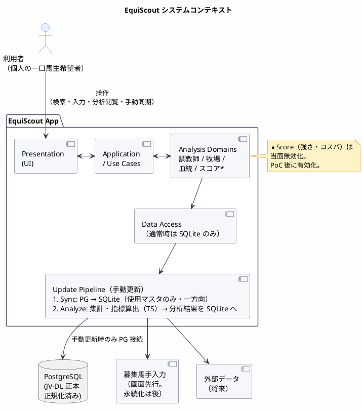
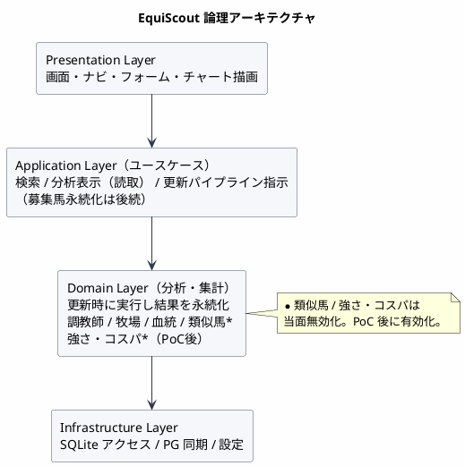
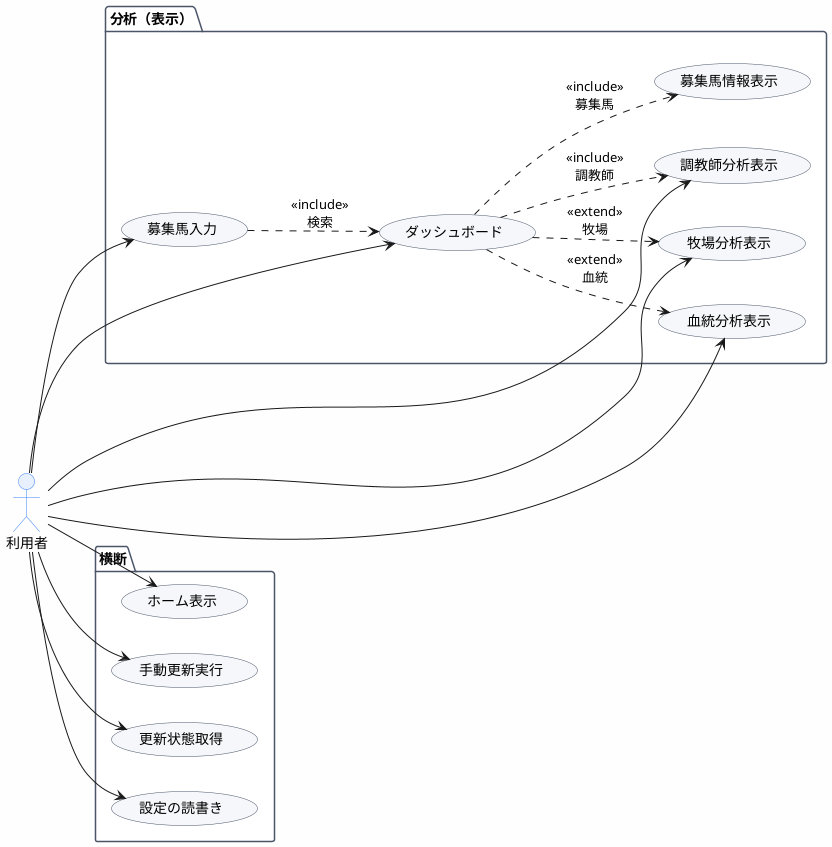

# EquiScout アーキテクチャ設計書

| 項目 | 内容 |
|------|------|
| 対象プロダクト | EquiScout |
| 根拠ドキュメント | [`doc/01_requirement/requirement.md`](../01_requirement/requirement.md) |
| 関連設計 | [`DB_design.md`](./DB_design.md) / [`UI_design.md`](./UI_design.md)（情報設計） / [`UI/`](./UI/README.md)（レイアウト・ビジュアル） / [`base_desing.md`](./base_desing.md) |
| 作成日 | 2026-07-26 |
| 更新日 | 2026-08-09 |
| 対象フェーズ | 調教師本実装＋将来拡張を見据えた骨格 |

---

## 目次

1. [目的と方針](#1-目的と方針)
2. [システムコンテキスト](#2-システムコンテキスト)
3. [論理アーキテクチャ](#3-論理アーキテクチャ)
4. [ユースケース設計](#4-ユースケース設計)
5. [ランタイム構成](#5-ランタイム構成)
6. [データアーキテクチャ（概要）](#6-データアーキテクチャ概要)
7. [技術選定](#7-技術選定)
8. [非機能アーキテクチャ](#8-非機能アーキテクチャ)
9. [未決事項・他設計への委譲](#9-未決事項他設計への委譲)
10. [まとめ](#10-まとめ)

---

## 1. 目的と方針

### 1.1 目的

一口馬主希望者が、JV-DL 由来のレース・マスタ情報をもとに、**調教師・生産牧場・血統**などを分析・可視化し、募集馬の比較検討を支援するデスクトップアプリのシステム構成を定める。

### 1.2 設計方針

| # | 方針 | 要求・決定との対応 |
|---|------|-------------------|
| 1 | **分析ドメインを UI から分離**する | 調教師 → 牧場 → 血統 → 総合評価の段階実装 |
| 2 | **データは二段構成**とする（PG 正本 / SQLite 読取モデル） | JV-DL は既存 PostgreSQL、アプリは表示・分析用に SQLite |
| 3 | **同期は一方向・アプリ使用マスタのみ** | 手動更新。SQLite → PG は行わない |
| 4 | **更新時に分析し、結果を SQLite へ永続化**する | 表示は計算せず読取。集計・回帰等は TypeScript（＋SQL） |
| 5 | **HTTP API は持たない** | データアクセスは SQL / ユースケース境界。Tauri 化時は IPC コマンド（`invoke`） |
| 6 | **スコアリングは差し替え可能なモジュール**にする | 強さ/コスパは PoC 後（当面非表示） |
| 7 | **Web コア先行、Tauri 後付け** | 開発はブラウザ + SQLite。製品は Win/Mac の Tauri |
| 8 | **ローカル完結**を基本とする | 個人利用。通常操作は SQLite のみでオフライン可 |

### 1.3 本文書の範囲

- システムの論理構成、**ユースケース設計**（要求 §3 の機能要求を Application 境界へ落とす）、ランタイム構成、技術選定、非機能
- UC の入出力契約・MOD ID → `base_desing.md`
- 詳細なテーブル定義 → `DB_design.md`（PostgreSQL 定義書 Excel を正本スキーマの根拠とする）
- 画面の情報設計 → `UI_design.md`
- 画面レイアウト・コンポーネント詳細 → `UI/`（画面・パネル単位）
- 強さ/コスパの計算式 → PoC 後に別紙（本アーキでは差し替え可能なモジュール境界のみ）

---

## 2. システムコンテキスト



### 2.1 外部境界

| 外部要素 | 接続方式 | 備考 |
|----------|----------|------|
| PostgreSQL（JV-DL） | 手動更新時のみ。アプリ使用マスタを SQLite へ抽出 | 正規化・テーブル分割済み。定義書（Excel）あり |
| SQLite（アプリ DB） | マスタスナップショット＋**分析結果**の永続化。通常操作の読取先 | 表示は分析済み行を読むだけ |
| 利用者入力 | UI フォーム | 募集馬は画面先行（永続化は後続） |
| クラブ公式サイト等 | **接続しない** | スクレイピングはスコープ外 |
| HTTP API / クラウド | **持たない** | ローカル完結。ユースケース境界、または Tauri IPC（`invoke`） |

---

## 3. 論理アーキテクチャ

レイヤード構成とする。上位層は下位層にのみ依存し、分析ロジックは UI や同期方式に依存しない。



### 3.1 層の責務

#### Presentation

- 操作フロー（1頭分析 / 単体分析 / 将来の複数頭比較）の画面遷移
- 分析ダッシュボード内の分析種類切替（プルダウン等）
- 表・グラフの描画（**分析済み SQLite データを表示**。重い集計は行わない）
- 調教師は実データ、牧場・血統・類似馬は最低限 UI（入力・プレースホルダ可）
- 募集馬: 入力フォームは用意。保存・再表示は後続でよい

#### Application

- ユースケースのオーケストレーション（詳細は §4）
  - 調教師の検索と分析結果表示
  - 募集馬入力とダッシュボード埋め込み
  - 牧場・血統の単体分析
  - 更新パイプライン実行と状態取得
- 表示時は原則として再集計しない（既に SQLite にある指標・率を返す）
- スコアリングモジュールの有無を設定で切り替え（当面オフ）
- **HTTP エンドポイントは公開しない**。開発時は同一プロセス内のユースケース境界呼び出し、製品時は Tauri IPC（`invoke`）経由で同じユースケース境界を呼ぶ

#### Domain

更新パイプラインの Analyze 段階で実行し、**成果物を SQLite の分析テーブルへ書き込む**。表示用ユースケースは主にその読取を行う。

| モジュール | 現状 | 責務 |
|------------|------|------|
| 調教師分析 | **本実装** | 着回数からの率算出、表示用指標の整形。結果を SQLite に保存 |
| 牧場分析 | UI骨格 | 生産者＝牧場。本実装は後続 |
| 血統分析 | UI骨格 | 距離/馬場適性・兄弟成績（本実装は後続） |
| 類似馬 | 表示枠のみ | 類似条件は PoC。差し替え可能な枠のみ先に用意 |
| 強さ/コスパ | 無効 | 回帰等を含む想定。PoC 後に Analyze 段階へ差し込む |

ドメインモジュールは共通の差し替え境界を持ち、ダッシュボードが分析種類 ID で切り替えられるようにする。Analyze 段階では、全件または対象 ID 単位で分析結果を SQLite へ書き込む入口を持つ。

#### Infrastructure

- SQLite への CRUD / クエリ（マスタスナップショット＋分析結果。通常時の唯一のデータソース）
- PostgreSQL からの同期（接続・抽出・変換・UPSERT）
- 設定（PG 接続情報、SQLite パス、最終更新日時など）
- ログ・エラー通知の基盤

---

## 4. ユースケース設計

要求 [`requirement.md`](../01_requirement/requirement.md) §3 の機能要求を、Application 層のユースケース境界へ落とす。入出力契約・IPC コマンド名は [`base_desing.md`](./base_desing.md) §5、画面対応は [`UI_design.md`](./UI_design.md) に委譲する。

### 4.1 アクターと操作フロー対応

| アクター | 説明 |
|----------|------|
| 利用者 | 個人の一口馬主希望者（要求 §1） |

要求 §3.1 の操作フローとユースケースの対応:

| 操作フロー | 主要ユースケース | 備考 |
|------------|------------------|------|
| 募集馬の1頭分析 | 募集馬入力 → ダッシュボード切替（→ 埋込先分析） | ダッシュボード内で分析種類を切替 |
| 調教師の単体分析 | 調教師名検索 → 調教師分析表示 | |
| 生産牧場の単体分析 | 生産牧場分析表示 | |
| 血統の単体分析 | 血統分析表示 | |
| 手動データ更新 | 手動更新実行 / 更新状態取得 | 要求 §6・アーキ方針 3/4 |



### 4.2 ユースケース一覧

| 名称 | 要求 |
|------|------|
| ホーム表示 | §1 利用シーン入口 |
| 募集馬入力・フォーム保持 | §3.2 |
| 分析ダッシュボード | §3.1・§3.3 |
| 募集馬情報表示 | | 
| 調教師分析表示 | §3.4 |
| 生産牧場分析表示 | §3.5 |
| 血統分析表示 | §3.6 |
| 手動更新実行（Sync→Analyze） | §6 |
| 更新状態取得 | §6 |
| 設定の読書き | §6 |

### 4.3 ユースケース詳細

#### 募集馬入力・フォーム保持

| 項目 | 内容 |
|------|------|
| 目的 | 募集馬1頭の属性を入力し、分析ダッシュボード表示の前提を揃える |
| 事前条件 | アプリ起動済み。馬名候補検索は SQLite マスタ参照可（未同期時は手入力のみでも可） |
| 基本フロー | 1. 必須項目を入力（下記）。2. 馬名・調教師等はテキスト → 候補選択可。3. フォーム状態を保持し、ダッシュボード切替へ進む |
| 必須入力 | 生年月日、性別、毛色、募集時体重（手入力のみ）、母名、父名、調教師、生産牧場、産地、市場取引価格（主）、馬主 |
| 任意入力 | 1口価格・口数（補助。価格方針は要求 §2） |
| 事後条件 | Presentation 上のフォーム状態が確定。**永続化は後続**（アプリ領域への CRUD は後でよい） |
| 例外・備考 | 類似馬等で価格不明の馬はコスパ対象外としうる（強さ分析のみ可）。募集時体重は JV-DL 外 |

#### 分析ダッシュボード切替・埋め込み

| 項目 | 内容 |
|------|------|
| 目的 | 同一ダッシュボード枠で分析種類を切り替え、対応する分析ビューを埋め込む |
| 事前条件 | 募集馬分析時は募集馬入力が完了していること。単体分析画面では対象が選択済みでも可 |
| 基本フロー | 1. 分析種類を選択（プルダウン等）。2. 対応する分析ビューを同一枠に表示。3. 調教師選択時は調教師分析表示（実データ）を埋め込む |
| 表示内容（要求 §3.3） | 募集馬分析（総合評価は PoC後）／類似馬枠／調教師／生産牧場／血統 |
| デフォルト表示 | 当面は固定。ユーザー設定は P1 |
| 事後条件 | 選択中分析の表示用データが読取表示される（表示時再集計なし） |
| 備考 | 単体画面の分析ビューとコンポーネント共用（情報設計と整合） |

#### 調教師分析表示

| 項目 | 内容 |
|------|------|
| 目的 | 選択した調教師の分析結果を表示する |
| 事前条件 | Analyze 済みの分析結果が SQLite にあること（無い場合は未更新を通知） |
| 基本フロー | 調教師を選択する → 分析結果テーブル読取 → 表示用に整形 → 単体画面またはダッシュボード埋込 |
| 表示指標 | 本年/前年/累計の賞金（本賞金・付加賞金）・着回数（1〜5着・着外）、勝率・連対率・複勝率、距離別着回数（芝/ダート×距離帯）、最近重賞勝利一覧 |
| 副作用 | なし（読取のみ。算出は手動更新の Analyze） |
| P1 | クラス別・新馬・勝ち上がり、多年推移グラフ（レース成績からの追加集計） |

#### 生産牧場分析表示

| 項目 | 内容 |
|------|------|
| 目的 | 生産牧場（＝生産者 BR / `jvd_br`）の成績を表示する |
| 指標 | まず BR 集計（本年・累計の賞金・着回数）→ ToBe: 出身馬リスト＋個別成績 |
| 呼び出し元 | 単体画面、またはダッシュボード切替（分析種類＝牧場） |

#### 血統分析表示

| 項目 | 内容 |
|------|------|
| 目的 | 距離適性・馬場適性・兄弟成績など血統観点の指標を表示する |
| 指標 | 距離適性（SMILE マッピング。境界値は実装時）、馬場適性（芝/ダート）、兄弟の成績 |
| 呼び出し元 | 単体画面、またはダッシュボード切替（分析種類＝血統） |

#### 手動更新実行 / 更新状態取得

| 項目 | 内容 |
|------|------|
| 目的 | PG → SQLite 同期のあと Domain 分析を実行し結果を永続化する／最終更新状態を返す |
| 基本フロー | Sync（使用マスタ）→ Analyze（調教師ほか）→ メタ更新 |
| 起動 | ホームまたは設定からの手動実行。起動時自動全更新は必須としない |
| 出力（状態取得） | 最終更新日時、実行状態、件数・エラー要約 |

#### ホーム表示 / 設定の読書き

| 名称 | 目的（要約） |
|------|----------------|
| ホーム表示 | 起動ランディング。分析画面・設定・データ更新への入口、短い更新状態 |
| 設定の読書き | PG 接続・パス等の設定読書き。更新詳細サマリの表示口 |

---

## 5. ランタイム構成

開発はブラウザ + SQLite を先行し、製品は Tauri で同じユースケース境界を IPC 経由で結ぶ。HTTP API は持たない。

### 5.1 開発（先行）: ブラウザ + SQLite

```text
┌─────────────────────────────────────────────┐
│  Browser                                     │
│  Frontend (React + TypeScript)               │
│         │                                    │
│         │ ユースケース境界呼び出し            │
│         ▼                                    │
│  Application + Domain + Infrastructure       │
│  SQLite（ファイル or 開発用）                 │
│  更新パイプライン: Sync → Analyze（手動更新時）│
└─────────────────────────────────────────────┘
```

ブラウザから直接 Node の `pg` / ネイティブ SQLite を叩けない制約がある場合は、**薄いローカルプロセス**（開発用のみ）でユースケースをホストしてよい。ただしこれは製品向け HTTP API ではなく、Tauri の IPC 境界に置き換える前提の一時的ホストとする。

### 5.2 製品: Tauri（Windows 主、macOS 対応）

```text
┌─────────────────────────────────────────────┐
│              Tauri                           │
│  ┌───────────────────────────────────────┐  │
│  │  WebView: React (Presentation)        │  │
│  └──────────────────┬────────────────────┘  │
│                     │ IPC（`invoke`。HTTP ではない）│
│  ┌──────────────────▼────────────────────┐  │
│  │  Rust Core: Commands（IPC 境界）      │  │
│  │    → Application + Domain（TS）       │  │
│  │    → SQLite アクセス                  │  │
│  │    → 更新パイプライン                 │  │
│  │         (Sync → Analyze → Write)      │  │
│  └───────────────────────────────────────┘  │
└─────────────────────────────────────────────┘
```

- 通常操作: WebView → IPC（`invoke`）→ Tauri Commands → **SQLite の分析結果・マスタを読取**
- 手動更新: コマンド側が PG 同期のあと Domain 分析を実行し、**結果を SQLite に UPSERT**
- Application / Domain / Sync / Analyze の TypeScript 資産は Web コアとして維持し、製品時は Tauri IPC から同一ユースケース境界を呼ぶ（実装は Rust 直呼び・Node サイドカー等。詳細は実装時確定）

---

## 6. データアーキテクチャ（概要）

詳細スキーマは `DB_design.md` に委譲する。PostgreSQL 側のテーブル定義は既存の **データベース定義書（Excel）** を正とする。

### 6.1 ストアの役割

| ストア | 役割 | 備考 |
|--------|------|------|
| **PostgreSQL** | JV-DL の正本 | 正規化・テーブル分割済み。アプリ外で管理・更新される |
| **SQLite** | マスタスナップショット＋**分析結果テーブル**＋アプリ固有データ | 更新時に書き、表示時に読む |

同期は **PostgreSQL → SQLite の一方向のみ**。分析結果も SQLite に閉じ、正本 PG は更新しない。

### 6.2 データ分類

| 分類 | 例 | 格納先 | 更新 |
|------|-----|--------|------|
| JV-DL マスタ（正本） | 調教師・生産者・競走馬等 | PostgreSQL | アプリ外（JV-DL 運用） |
| マスタスナップショット | 調教師の賞金・着回数・距離別・最近重賞など（同期コピー） | SQLite | 更新パイプライン Sync 段階 |
| **分析結果** | 勝率・連対率・複勝率、整形済み表示用指標、（将来）回帰スコア等 | SQLite | 更新パイプライン Analyze 段階 |
| 追加集計（将来） | 年別推移、クラス別、新馬、勝ち上がり | SQLite（分析結果） | P1。元は PG レース成績を Sync 後に Analyze |
| ユーザー入力 | 募集馬、1口価格・口数、募集時体重 | SQLite（アプリ領域） | CRUD。**当面は画面のみ可** |
| アプリ設定 | PG 接続、最終更新日時、表示デフォルト（P1） | SQLite / 設定ファイル | CRUD |

### 6.3 永続化方針

- **通常時のメインストア**: SQLite
  - 検索・分析**表示**はすべて SQLite（分析結果テーブル優先）
  - バックアップは DB ファイルコピーで可能
- **更新時**:
  1. PostgreSQL から使用マスタを抽出 → SQLite に UPSERT（Sync）
  2. TypeScript の Domain で集計・指標算出（必要なら回帰等）→ 分析結果を SQLite に UPSERT（Analyze）
- **募集馬**: JV-DL 馬マスタと分離したアプリ領域に保存する（実装は後続で可）
- SQLite には JV-DL 全カラムの完全ミラーは不要。**画面・分析が要する形**に落とす

### 6.4 同期・分析範囲（設計決定）

| 優先 | 対象 | 実施 |
|------|------|------|
| 必須 Sync | 調教師（CH 相当）および分析に必要な関連表 | **する** |
| 必須 Analyze | 勝率・連対率・複勝率、表示用に必要な整形 | **する**（結果を SQLite へ） |
| 後続 | 生産者(BR)、競走馬(UM)、HS、BT、レース成績、回帰スコア等 | Sync/Analyze 対象に追加 |

```text
PostgreSQL (使用マスタのみ)
  → Sync: 抽出 / 変換 → SQLite（マスタ）
  → Analyze: Domain（TS 集計・指標）→ SQLite（分析結果）
  → 更新メタ（最終更新日時・件数など）を更新
```

### 6.5 価格データの扱い

- 分析の価格主データ: HS（市場取引価格）。同期対象に含めるのは HS 利用フェーズ以降
- 募集馬入力の補助: 1口価格・口数（JV-DL 外、アプリ領域のみ）
- コスパ評価対象外（価格不明）の扱いは強さ/コスパモジュール側のルールとし、他分析は価格なしでも動作可能にする

### 6.6 TypeScript による分析の位置づけ

| 処理 | TypeScript での扱い | 備考 |
|------|---------------------|------|
| 集計・率・ランキング | **十分容易** | SQL（SQLite）＋ TS。本線の中心 |
| 単純な回帰・相関 | **可能** | `simple-statistics` / `ml-regression` / `danfojs` 等 |
| 大規模 ML・高度な統計 PoC | 必要なら後から分離 | まずは TS。足りなければ Python 等を Analyze プラグイン化 |

本 PJ では分析実行環境を **TypeScript に統一**する。更新パイプラインの Analyze 段階に閉じることで、UI スレッドを重くしない。

---

## 7. 技術選定

### 7.1 決定スタック

| 領域 | 選定 | 理由 |
|------|------|------|
| Frontend | **TypeScript + React** | コンポーネント分割・チャート・Tauri WebView 親和性 |
| チャート | 実装時選定（Recharts / Chart.js / ECharts 等） | 賞金・着回数・距離別の棒/折れ線が中心 |
| データアクセス | **TypeScript**（SQL クライアント / クエリビルダ） | API サーバ不要。SQL が扱えれば十分 |
| **分析・集計** | **TypeScript**（＋ SQLite SQL） | 更新時に実行。率・集計は標準的。回帰は統計/ML ライブラリ |
| 正本 DB | **PostgreSQL**（既存 JV-DL） | 正規化済み。アプリ外管理 |
| アプリ DB | **SQLite** | マスタスナップショット＋分析結果。通常操作・オフライン |
| デスクトップ | **Tauri**（後付け） | Win/Mac 両対応。軽量。Web コアを WebView に載せ `invoke` で結ぶ |
| ネイティブシェル | **Rust**（Tauri Core） | ウィンドウ・FS・コマンド境界。重い分析は TS ユースケース側 |
| 開発形態 | **ブラウザ + SQLite 先行** | Tauri 包装は製品化時 |
| パッケージ管理 | pnpm / npm 等、リポジトリ方針に従う | — |

### 7.2 選定の代替と制約

- **Electron** は採用しない（バンドル肥大・Chromium 同梱が個人デスクトップ用途に重い）。デスクトップは **Tauri** とする
- **製品向け HTTP API は持たない**（開発用ホストを一時的に置く場合も IPC 置換前提）。接続方式は §5 を参照
- PG 同期 + SQLite + 分析の **TypeScript 資産は Web コアとして維持**し、Tauri はシェル／IPC（`invoke`）境界とする。Rust へのロジック移植は必須としない（必要なら後続）
- **クラウド DB / マルチユーザー認証**はスコープ外
- 対象 OS: **Windows を主**、**macOS も製品対応**
- 分析を Python に寄せる必要が出た場合は、Analyze 段階のプラグインとして後付け可能とする（当面は不要）

### 7.3 リポジトリ構成（案）

```text
EquiScoutApp/
  apps/
    web/                 # Presentation (React) ※開発の主戦場
    desktop/             # 将来: Tauri シェル（Rust + WebView）
  packages/
    app-core/            # Application + Domain（ユースケース）
    domain/              # 分析ドメイン（純ロジック、UI非依存）※ app-core 内でも可
    db/                  # SQLite スキーマ・マイグレーション（マスタ＋分析結果）
    sync/                # PostgreSQL → SQLite 同期
    analysis/            # 更新時 Analyze（集計・回帰等）※ domain と統合でも可
  doc/
    01_requirement/
    02_design/
```

モノレポとし、Domain / Sync / Analysis を UI から分離してテスト可能にする。

---

## 8. 非機能アーキテクチャ

### 8.1 利用形態

- 単一ユーザー・デスクトップ（製品は Tauri）
- 開発はブラウザでも可
- 更新パイプライン実行済みであれば、通常操作は PostgreSQL なしでオフライン利用可能

### 8.2 性能（目安）

| 操作 | 目安 |
|------|------|
| 調教師名検索 | 入力に対しインタラクティブ（SQLite インデックス必須） |
| 調教師分析表示 | 単一 ID の分析結果読取で即時（表示時再集計なし） |
| 手動更新（Sync + Analyze） | バックグラウンド実行＋進捗表示（UI をブロックしない） |

### 8.3 信頼性・データ整合

- Sync / Analyze はトランザクション方針を `DB_design.md` で定める（マスタのみ更新後に Analyze 失敗、など）
- 正本側の削除・更新を SQLite スナップショットに正しく反映する
- 失敗時は部分適用の有無をログに残し、UI で通知
- UI に最終更新日時を出す

### 8.4 セキュリティ・プライバシー

- データはローカルに閉じる
- PostgreSQL 接続情報はローカル設定に保持し、外部送信しない
- WebView（またはブラウザ）から PG/SQLite へ直接接続せず、Tauri Commands / データアクセス層経由とする（製品時）
- JV-DL データの再配布は行わない（利用者が正当に保持する PG データを参照する前提）

### 8.5 保守・拡張

- 分析モジュールの追加が Application / UI の大規模改修なしで行えること（Analyze プラグイン）
- 同期対象マスタの追加が Sync プラグイン追加で行えること
- 表示デフォルトのユーザー設定（P1）に備え、ダッシュボードのレイアウト定義をデータ化できる余地を残す（当面は固定設定で可）

---

## 9. 未決事項・他設計への委譲

| 項目 | 状態 | 委譲先 |
|------|------|--------|
| SQLite テーブル・インデックス詳細（マスタ／分析結果の分離） | 未決 | `DB_design.md` |
| PG 定義書とのカラムマッピング | 未決 | `DB_design.md`（Excel 定義書を根拠） |
| Sync 成功後 Analyze 失敗時の整合方針 | 未決 | `DB_design.md` |
| 画面ワイヤ・コンポーネント詳細 | 未決 | `UI/`（情報設計は `UI_design.md`） |
| 主要コンポーネント一覧 / ユースケース入出力契約 | 委譲 | `base_desing.md`（論理ユースケースは本書 §4） |
| SQLite ファイル配置（ユーザーデータディレクトリ等） | 未決 | `DB_design.md` / 実装時 |
| PG 接続設定の UX | 未決 | UI / 設定 |
| 強さ/コスパ計算式・回帰の具体 | 未定（PoC） | PoC 報告書 → 強さ/コスパ実装 |
| 類似馬の定義 | 未定（PoC） | 類似馬実装時 |
| SMILE 距離帯の境界値 | 実装時確定 | 血統分析 / DB |
| 定期更新の有無 | 任意（非必須） | 設定 + スケジューラ |
| ブラウザ開発時の SQLite/PG ホスト方式 | 実装時確定 | 開発用ホスト or 同等 |
| Tauri から TS ユースケースを呼ぶ方式 | 実装時確定 | Rust 直実装 / Node サイドカー等 |
| 統計/回帰ライブラリの最終選定 | 実装時（PoC 前でも可） | `analysis` パッケージ |

---

## 10. まとめ

EquiScout は **PostgreSQL 上の JV-DL を正本**とし、**SQLite にマスタスナップショットと分析結果**を持つローカル分析アプリとする。手動更新は **Sync（PG→SQLite）→ Analyze（TypeScript 集計・指標）→ 結果を SQLite へ永続化** のパイプラインとし、表示は再計算せず読取に徹する。HTTP API は持たず、ユースケース境界（のち Tauri IPC）で結ぶ。機能要求は §4 のユースケース（調教師分析・募集馬ダッシュ埋込・牧場/血統・更新）に落とし、調教師の Sync/Analyze と表示を縦に貫通させ、募集馬は画面先行、牧場・血統・類似・スコアは同一モジュール枠で後付けする。開発はブラウザ + SQLite、製品は Windows / macOS の Tauri を後付けする。
