# EquiScout 基本設計書

| 項目 | 内容 |
|------|------|
| 対象プロダクト | EquiScout |
| 根拠ドキュメント | [`requirement.md`](../01_requirement/requirement.md) / [`architecture.md`](./architecture.md)（ユースケース正本は §4） |
| 関連設計 | [`UI_design.md`](./UI_design.md) / [`UI/`](./UI/README.md) / [`DB_design.md`](./DB_design.md) |
| 作成日 | 2026-08-09 |
| 更新日 | 2026-08-09 |
| 対象フェーズ | 調教師本実装＋将来拡張を見据えた骨格 |
| 文書ステータス | **実装向け基本設計**（ユースケース単位コンポーネント設計） |

---

## 目次

1. [目的と範囲](#1-目的と範囲)
2. [前提・制約](#2-前提制約)
3. [設計単位の定義](#3-設計単位の定義)
4. [ユースケース一覧と横断マップ](#4-ユースケース一覧と横断マップ)
5. [ユースケース別コンポーネント設計](#5-ユースケース別コンポーネント設計)
6. [共有コンポーネントカタログ](#6-共有コンポーネントカタログ)
7. [パッケージ構成と依存ルール](#7-パッケージ構成と依存ルール)
8. [外部 IF・IPC 仕様](#8-外部-ifipc-仕様)
9. [エラー・状態・ログ規約](#9-エラー状態ログ規約)
10. [設定項目](#10-設定項目)
11. [実装フェーズ対応](#11-実装フェーズ対応)
12. [未決事項・委譲](#12-未決事項委譲)
13. [変更履歴](#13-変更履歴)

---

## 1. 目的と範囲

### 1.1 目的

[`architecture.md`](./architecture.md) §4 のユースケースを実装単位へ落とし、**ユースケースごとに** Application / Domain / Presentation / Infrastructure のコンポーネント境界・入出力仕様・IPC 対応を固定する。

### 1.2 範囲に含むもの

- ユースケース単位のコンポーネント設計（画面・サービス・ドメイン・インフラの対応）
- 各ユースケースの入出力仕様・副作用・エラー
- 更新パイプライン（同期 → 分析）を構成するモジュール分割
- 開発時呼び出し／製品時 Tauri 呼び出しの公開面
- 共有コンポーネントの索引（詳細レイアウトは UI 文書）

### 1.3 範囲に含まないもの

- アーキテクチャ方針・技術選定の再定義 → [`architecture.md`](./architecture.md)
- 画面の情報設計・レイアウト・ビジュアル詳細 → [`UI_design.md`](./UI_design.md) / [`UI/`](./UI/README.md)
- 物理スキーマ・DDL → [`DB_design.md`](./DB_design.md)
- 強さ／コスパ計算式 → PoC 後別紙

---

## 2. 前提・制約

方針の正本はアーキテクチャ。実装時に毎回効く制約のみ列挙する。

| # | 制約 | 根拠 |
|---|------|------|
| 1 | HTTP API は持たない。ユースケース境界（のち Tauri 経由） | アーキ 方針 5 |
| 2 | 表示時は再集計しない。更新時の分析結果を読取 | アーキ 方針 4 |
| 3 | 同期は PostgreSQL → SQLite 一方向。使用マスタのみ | アーキ 方針 3 |
| 4 | ローカル完結・単一ユーザー | アーキ §8 |
| 5 | 募集馬の永続化は後続。当面は画面上のフォーム状態のみ | アーキ §4 募集馬入力 |
| 6 | 強さ／コスパ・類似馬本実装は当面無効（枠のみ） | アーキ Domain |

---

## 3. 設計単位の定義

| 単位 | 意味 |
|------|------|
| **ユースケース** | Application 層の公開操作境界。1 公開操作＝1 ユースケース |
| **論理モジュール** | 層をまたぐ再利用・差し替え単位（例: 調教師分析、同期、設定） |
| **画面／ビュー** | Presentation の画面・パネル・分析ビュー |
| **サービス** | Application 内のオーケストレーション実装（原則ユースケース 1 つに 1 つ） |

### 3.1 層と責務（要約）

| 層 | 本書での扱い |
|----|--------------|
| Presentation | 画面／ビュー。ユースケースを呼び、表示用データを描画するだけ |
| Application | ユースケース／サービス。入出力仕様の所有者 |
| Domain | 更新時分析の純ロジック。表示系ユースケースは原則ドメインを呼ばず結果テーブルを読む |
| Infrastructure | SQLite／PostgreSQL／設定。ユースケースからリポジトリ経由で利用 |

### 3.2 コンポーネント設計の書き方（各ユースケース共通）

各ユースケース節は次を必須とする。

1. **仕様**（目的・事前条件・入力・出力・副作用・エラー）
2. **構成コンポーネント**（Presentation / Application / Domain / Infrastructure）
3. **フロー**（PlantUML）
4. **IPC 公開面**（操作の意味）
5. **実装の位置づけ**（本実装／骨格／後続の要約。詳細は §11）

表記方針: 関数名・変数名・型名は書かない。入出力は意味で記述する。図は PlantUML とする。各ユースケースの「仕様」は、画面や IPC から見た入出力・副作用・エラーの取り決めを指す。

---

## 4. ユースケース一覧と横断マップ

論理ユースケースの正本は [`architecture.md`](./architecture.md) §4。本書は実装向けのコンポーネント対応を付与する。

### 4.1 一覧

| 名称 | 要求 | 主モジュール | 主画面／ビュー |
|------|------|--------------|----------------|
| ホーム表示 | §1 入口 | Application | ホーム |
| 募集馬入力・フォーム保持 | §3.2 | Application / Presentation | 募集馬入力 |
| 分析ダッシュボード切替・埋め込み | §3.1・§3.3 | Application | 分析ダッシュボード |
| 募集馬情報表示 | §3.3 | Application | 募集馬プロフィール |
| 調教師名検索 | §3.4 | Application | 調教師検索 |
| 調教師分析表示 | §3.4 | Application | 調教師分析ビュー |
| 生産牧場分析表示 | §3.5 | Application | 牧場分析ビュー |
| 血統分析表示 | §3.6 | Application | 血統分析ビュー |
| 手動更新実行（同期→分析） | §6 | 更新パイプライン | 更新コントロール |
| 更新状態取得 | §6 | Application | 更新コントロール／ホーム |
| 設定の読書き | §6 | 設定 | 設定 |

> 調教師名検索はアーキ §4.3「調教師を選択する」の前提操作として独立ユースケースとする（検索と分析表示の仕様を分離し、ダッシュボード埋込でも再利用する）。

### 4.2 操作フロー対応

| 操作フロー（要求 §3.1） | 呼び出すユースケース |
|-------------------------|----------------------|
| 募集馬の1頭分析 | 募集馬入力 → ダッシュボード切替 →（切替）募集馬情報／調教師分析／牧場分析／血統分析 |
| 調教師の単体分析 | 調教師名検索 → 調教師分析表示（単体画面。必要ならダッシュボード枠） |
| 生産牧場の単体分析 | 生産牧場分析表示 |
| 血統の単体分析 | 血統分析表示 |
| 手動データ更新 | 手動更新実行／更新状態取得 |
| 起動・設定 | ホーム表示／設定の読書き |

```plantuml
@startuml EquiScout_operation_flows
left to right direction
skinparam backgroundColor #FEFEFE
skinparam activity {
  BackgroundColor #F5F7FA
  BorderColor #4A5568
}

title 操作フローとユースケースの対応（概要）

|募集馬の1頭分析|
start
:募集馬入力・フォーム保持;
:分析ダッシュボード切替・埋め込み;
fork
  :募集馬情報表示;
fork again
  :調教師分析表示;
fork again
  :生産牧場分析表示;
fork again
  :血統分析表示;
end fork
stop

|調教師の単体分析|
start
:調教師名検索;
:調教師分析表示;
stop

|手動データ更新|
start
:手動更新実行;
:更新状態取得;
stop
@enduml
```

### 4.3 論理モジュール一覧（横断）

| 名称 | 層 | 責務 | 依存してよい相手 |
|------|-----|------|------------------|
| Presentation | Presentation | 画面・ナビ・フォーム・チャート描画。集計しない | Application（ユースケース境界のみ） |
| Application | Application | ユースケース オーケストレーション | Domain 各分析／更新パイプライン／Infrastructure |
| 調教師分析 | Domain | 更新時の率算出・表示用整形・結果書込 | SQLite アクセス |
| 牧場分析 | Domain | 分析骨格（後続本実装） | SQLite アクセス |
| 血統分析 | Domain | 分析骨格（後続本実装） | SQLite アクセス |
| 類似馬 | Domain | 差し替え枠のみ | SQLite アクセス |
| 強さ／コスパ | Domain | 差し替え枠。当面無効 | SQLite アクセス |
| 同期 | Pipeline | PostgreSQL → SQLite 抽出・反映 | PG 接続／SQLite アクセス |
| 分析オーケストレータ | Pipeline | Domain 分析の実行順・書込指示 | Domain 各分析／SQLite アクセス |
| 更新パイプライン | Pipeline | 同期 → 分析 → メタ更新の順序制御 | 同期／分析／設定 |
| SQLite アクセス | Infrastructure | マスタ／分析結果の読書き | — |
| PG 接続 | Infrastructure | 手動更新時のみ | — |
| 設定 | Infrastructure | 接続情報・パス・最終更新 | — |
| Tauri Shell | Runtime | IPC・ウィンドウ（製品時） | Application |

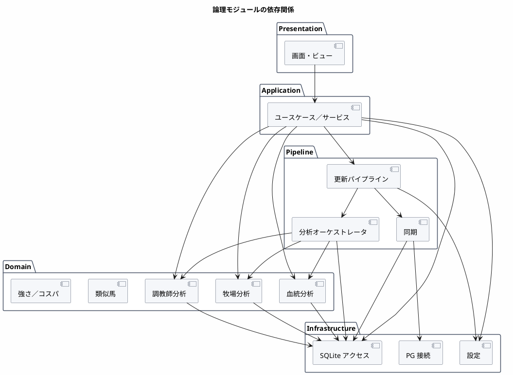

---

## 5. ユースケース別コンポーネント設計

---

### 5.1 ホーム表示

#### 仕様

| 項目 | 内容 |
|------|------|
| 目的 | 起動ランディング。分析画面・設定・データ更新への入口と短い更新状態を返す |
| 事前条件 | アプリ起動済み。SQLite 未初期化でも入口は表示可（更新誘導） |
| 入力 | なし |
| 出力 | ナビ先一覧、更新状態の要約（最終成功日時・実行中の有無） |
| 副作用 | なし（読取のみ。更新状態取得と同等の薄い読取でよい） |
| エラー | DB 未初期化 → 警告付きで設定／更新へ誘導（画面は表示） |
| 非機能 | 起動直後に即時表示 |

#### 構成コンポーネント

| 種別 | 名称 | 責務 |
|------|------|------|
| Presentation | ホーム | 入口カード群・短い更新サマリの表示 |
| Presentation | アプリシェル（共有） | グローバルナビ／ヘッダ |
| Application | ホーム表示サービス | ナビ定義の組み立て＋更新要約の取得 |
| Infrastructure | 設定 | 最終更新メタの読取 |
| Infrastructure | SQLite アクセス | 初期化有無の疎通（任意） |

UI 参照: [`UI/home.md`](./UI/home.md)

#### フロー

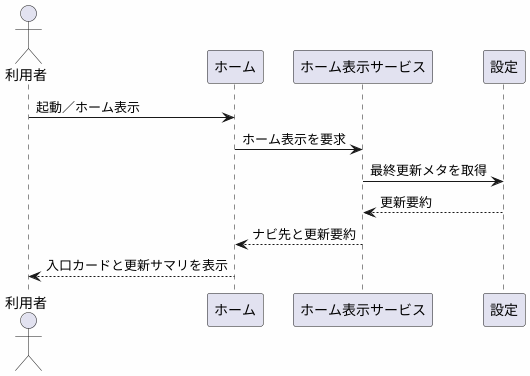

#### IPC 公開面

| 操作 | 引数（意味） | 戻り値（意味） |
|------|--------------|----------------|
| ホーム表示 | なし | ナビ先一覧、更新要約 |

#### 実装の位置づけ

本実装（MVP）。

---

### 5.2 募集馬入力・フォーム保持

#### 仕様

| 項目 | 内容 |
|------|------|
| 目的 | 募集馬1頭の属性を入力し、ダッシュボード表示の前提を揃える |
| 事前条件 | アプリ起動済み。馬名候補検索は SQLite マスタ参照可（未同期時は手入力のみ可） |
| 入力（必須） | 生年月日、性別、毛色、募集時体重、母名、父名、調教師、生産牧場、産地、市場取引価格、馬主 |
| 入力（任意） | 1口価格・口数 |
| 補助入力 | 馬名・調教師等のテキスト → 候補選択（マスタ検索。未ヒット時は手入力値を保持） |
| 出力 | 画面保持用の募集馬フォーム状態 |
| 副作用 | **なし（永続化は後続）**。当面はメモリ／画面状態のみ |
| エラー | 必須欠落 → フィールド検証。候補検索失敗 → 手入力継続可 |
| 非機能 | 候補検索はインタラクティブ（SQLite インデックス前提） |

#### 構成コンポーネント

| 種別 | 名称 | 責務 |
|------|------|------|
| Presentation | 募集馬入力 | フォーム全体。必須／任意フィールドの入力・検証表示 |
| Presentation | エンティティ検索ボックス（共有） | 馬名・調教師・牧場等の候補選択 UI |
| Application | 募集馬入力サービス | 検証ルール適用、候補検索の委譲、フォーム状態の確定 |
| Application | マスタ候補検索サービス（共有） | 名前部分一致でマスタ候補を返す |
| Infrastructure | SQLite アクセス | マスタ候補クエリ（競走馬／調教師／生産者等のスナップショット） |

UI 参照: [`UI/panels/horse_entry.md`](./UI/panels/horse_entry.md) / [`UI/horse.md`](./UI/horse.md)

#### フロー

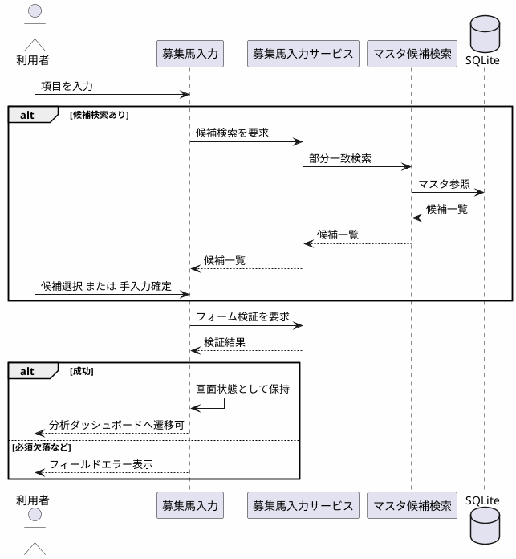

#### IPC 公開面

| 操作 | 引数（意味） | 戻り値（意味） |
|------|--------------|----------------|
| 募集馬候補検索 | 対象項目、検索文字列 | 候補一覧（識別子・表示名） |
| 募集馬フォーム検証 | フォーム状態 | 成否、エラー一覧 |

> 保存操作は後続フェーズで追加。当面は画面が状態を保持し、ダッシュボードへ渡す。

#### 実装の位置づけ

画面＋検証＋候補検索は本実装。CRUD 永続化は後続。

---

### 5.3 分析ダッシュボード切替・埋め込み

#### 仕様

| 項目 | 内容 |
|------|------|
| 目的 | 同一ダッシュボード枠で分析種類を切り替え、対応する分析ビューを埋め込む |
| 事前条件 | 募集馬分析時は募集馬入力完了。単体分析では対象選択済みでも可 |
| 入力 | 分析種類（募集馬／調教師／牧場／血統。将来は類似馬／総合評価）、コンテキスト（募集馬フォームまたは単体対象） |
| 出力 | 選択中の分析種類と、埋め込み先ビュー用のデータ（各分析ユースケースの出力） |
| 副作用 | なし（切替は読取ユースケースの呼び出しのみ） |
| エラー | 未対応の種類 → プレースホルダ。対象なし → 空状態 |
| 非機能 | 切替は即時。再集計しない |
| 備考 | 単体画面の分析ビューとコンポーネント共用 |

#### 構成コンポーネント

| 種別 | 名称 | 責務 |
|------|------|------|
| Presentation | 分析ダッシュボード | 分析種類セレクタ＋埋め込み枠 |
| Presentation | 分析種類セレクタ | プルダウン等。当面は固定選択肢 |
| Presentation | 埋込先: 募集馬プロフィール／調教師分析ビュー／牧場分析ビュー／血統分析ビュー | 単体画面と同一ビュー |
| Application | ダッシュボード切替サービス | 分析種類に応じた表示ユースケースのディスパッチ |
| Domain | （表示時は呼ばない） | 分析済み結果は各表示ユースケースが読む |

UI 参照: [`UI/analysis_dashboard.md`](./UI/analysis_dashboard.md) / [`UI/panels/dashboard.md`](./UI/panels/dashboard.md)

#### フロー

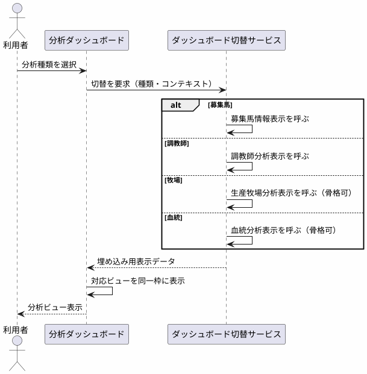

#### IPC 公開面

| 操作 | 引数（意味） | 戻り値（意味） |
|------|--------------|----------------|
| ダッシュボード切替 | 分析種類、コンテキスト | 分析種類、埋め込み用表示データ |

> 実装では各表示ユースケースの公開操作を直接呼んでもよい。ダッシュボード切替はオーケストレーション用の任意ラッパ。

#### 実装の位置づけ

切替枠は本実装。デフォルト種類は固定（ユーザー設定は後続）。類似馬／総合評価は選択肢に出さないか、出してもプレースホルダ。

---

### 5.4 募集馬情報表示

#### 仕様

| 項目 | 内容 |
|------|------|
| 目的 | 入力済み募集馬の属性をダッシュボード内（または要約）で表示する |
| 事前条件 | 募集馬フォーム状態が存在すること |
| 入力 | 募集馬フォーム状態（将来は永続化キーでも可） |
| 出力 | 募集馬プロフィール用の表示データ（計算指標は含めない） |
| 副作用 | なし |
| エラー | フォームなし → 空状態／入力画面へ誘導 |
| 備考 | 総合評価・類似馬は枠のみ（PoC 後）。本ユースケースはプロフィール表示に限定 |

#### 構成コンポーネント

| 種別 | 名称 | 責務 |
|------|------|------|
| Presentation | 募集馬プロフィール | 募集馬プロフィール表／要約 |
| Application | 募集馬情報表示サービス | フォーム状態を表示用データへ整形 |
| Domain | — | なし（表示時計算なし） |
| Infrastructure | — | 当面なし（後続永続化時に読取追加） |

UI 参照: [`UI/panels/horse_profile.md`](./UI/panels/horse_profile.md)

#### フロー

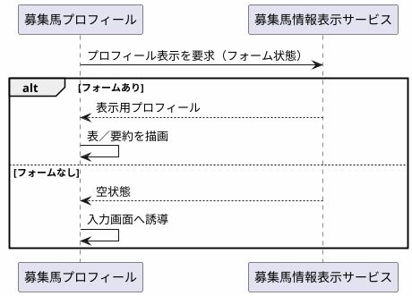

#### IPC 公開面

| 操作 | 引数（意味） | 戻り値（意味） |
|------|--------------|----------------|
| 募集馬情報表示 | フォーム状態 | プロフィール表示データ |

#### 実装の位置づけ

フォーム状態の表示は本実装。DB 読取は後続。

---

### 5.5 調教師名検索

#### 仕様

| 項目 | 内容 |
|------|------|
| 目的 | 調教師名の部分一致候補を返し、分析対象を確定させる |
| 事前条件 | SQLite に調教師マスタスナップショットがあること（無い場合は空一覧＋未更新案内） |
| 入力 | 検索文字列（空なら空一覧） |
| 出力 | 候補一覧（調教師の識別子・名称など） |
| 副作用 | なし（SQLite 読取のみ） |
| エラー | DB 未初期化 → 設定／更新誘導。過長な検索文字列は打ち切り |
| 非機能 | 入力に対しインタラクティブ（アーキ §8.2） |

#### 構成コンポーネント

| 種別 | 名称 | 責務 |
|------|------|------|
| Presentation | 調教師検索 | 検索ボックス＋候補リスト |
| Presentation | エンティティ検索ボックス（共有） | 共通検索 UI |
| Application | 調教師検索サービス | クエリ正規化・件数上限・表示用への変換 |
| Infrastructure | 調教師マスタリポジトリ（SQLite） | 名前インデックス検索 |

UI 参照: [`UI/panels/trainer_search.md`](./UI/panels/trainer_search.md)

#### フロー

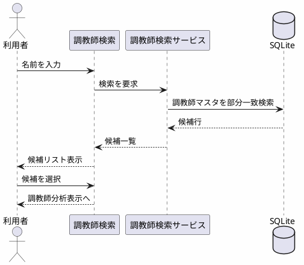

#### IPC 公開面

| 操作 | 引数（意味） | 戻り値（意味） |
|------|--------------|----------------|
| 調教師名検索 | 検索文字列 | 候補一覧 |

#### 実装の位置づけ

本実装。勝率ランキング一覧からの選択は対象外。

---

### 5.6 調教師分析表示

#### 仕様

| 項目 | 内容 |
|------|------|
| 目的 | 選択した調教師の **分析済み**結果を表示する |
| 事前条件 | 更新時分析済みの結果が SQLite にあること（無い場合は未更新を通知） |
| 入力 | 調教師の識別子 |
| 出力 | 調教師分析の表示データ（下記表示指標） |
| 表示指標 | 本年/前年/累計の賞金（本賞金・付加賞金）・着回数（1〜5着・着外）、勝率・連対率・複勝率、距離別着回数（芝/ダート×距離帯）、最近重賞勝利一覧 |
| 副作用 | なし（読取のみ。算出は手動更新実行の分析段階） |
| エラー | 結果なし → 空状態＋手動更新誘導。不正な識別子 → 見つからない |
| 非機能 | 単一対象の読取で即時（アーキ §8.2） |
| 後続 | クラス別・新馬・勝ち上がり、多年推移グラフ |

#### 構成コンポーネント

| 種別 | 名称 | 責務 |
|------|------|------|
| Presentation | 調教師分析ビュー | 単体画面・ダッシュ埋込共用の分析ビュー |
| Presentation | 指標表／率表示／棒グラフ（共有） | 賞金・着回・率・距離別の描画 |
| Application | 調教師分析表示サービス | 分析結果読取 → 表示用整形（再集計しない） |
| Domain | 調教師分析 | **表示時は呼ばない**。更新時分析のみ使用（§5.9） |
| Infrastructure | 調教師分析結果リポジトリ（SQLite） | 分析結果テーブル読取 |
| Infrastructure | 調教師マスタリポジトリ | 名称等マスタ補完（任意） |

UI 参照: [`UI/panels/trainer_analysis.md`](./UI/panels/trainer_analysis.md) / [`UI/trainer.md`](./UI/trainer.md)

#### フロー

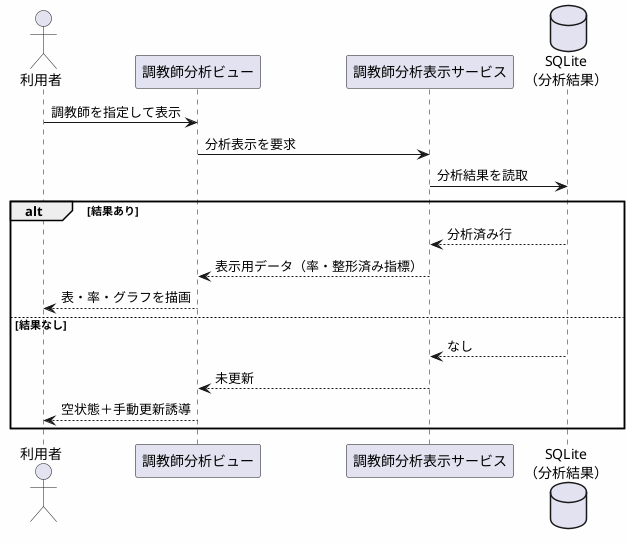

#### IPC 公開面

| 操作 | 引数（意味） | 戻り値（意味） |
|------|--------------|----------------|
| 調教師分析表示 | 調教師の識別子 | 調教師分析の表示データ |

#### 表示データの論理内容

| グループ | 内容 |
|----------|------|
| 識別 | 調教師の識別子、名称 |
| 賞金 | 本年／前年／累計の本賞金・付加賞金 |
| 着回 | 本年／前年／累計の 1〜5 着・着外 |
| 率 | 勝率・連対率・複勝率 |
| 距離別 | 芝／ダート × 距離帯ごとの着回 |
| 重賞 | 最近重賞勝利一覧 |
| メタ | 分析日時 |

物理カラムは `DB_design.md` に委譲。

#### 実装の位置づけ

本実装（縦貫通の中心）。

---

### 5.7 生産牧場分析表示

#### 仕様

| 項目 | 内容 |
|------|------|
| 目的 | 生産牧場（＝生産者）の成績を表示する |
| 事前条件 | 骨格では対象または名称があればプレースホルダ表示可。本実装時は分析済み結果が必要 |
| 入力 | 生産者の識別子、または募集馬コンテキスト上の牧場参照 |
| 出力 | 牧場分析の表示データ（骨格時はプレースホルダ可。本実装時は本年・累計の賞金・着回） |
| 副作用 | なし |
| 呼び出し元 | 単体画面、または分析ダッシュボード（牧場） |
| 将来 | 出身馬リスト＋個別成績 |

#### 構成コンポーネント

| 種別 | 名称 | 責務 |
|------|------|------|
| Presentation | 牧場分析ビュー | 単体／ダッシュ共用。骨格 UI |
| Application | 牧場分析表示サービス | 読取またはプレースホルダ表示データ |
| Domain | 牧場分析 | 更新時分析（後続）。表示時は呼ばない |
| Infrastructure | 牧場分析結果リポジトリ | 後続で分析結果読取 |

UI 参照: [`UI/panels/farm.md`](./UI/panels/farm.md) / [`UI/farm.md`](./UI/farm.md)

#### フロー

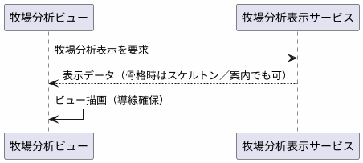

#### IPC 公開面

| 操作 | 引数（意味） | 戻り値（意味） |
|------|--------------|----------------|
| 生産牧場分析表示 | 生産者の識別子 | 牧場分析の表示データ |

#### 実装の位置づけ

UI 骨格。本実装は牧場優先度フェーズ。

---

### 5.8 血統分析表示

#### 仕様

| 項目 | 内容 |
|------|------|
| 目的 | 距離適性・馬場適性・兄弟成績など血統観点の指標を表示する |
| 事前条件 | 骨格では入力血統（父母名等）があればプレースホルダ可 |
| 入力 | 血統の参照（父母・対象馬等。募集馬コンテキストから供給可） |
| 出力 | 血統分析の表示データ（距離適性、馬場適性、兄弟成績。骨格時は空枠） |
| 副作用 | なし |
| 呼び出し元 | 単体画面、または分析ダッシュボード（血統） |
| 備考 | 距離帯の境界値は実装時確定（アーキ §9） |

#### 構成コンポーネント

| 種別 | 名称 | 責務 |
|------|------|------|
| Presentation | 血統分析ビュー | 単体／ダッシュ共用。骨格 UI |
| Application | 血統分析表示サービス | 読取またはプレースホルダ |
| Domain | 血統分析 | 更新時分析（後続） |
| Infrastructure | 血統分析結果リポジトリ | 後続 |

UI 参照: [`UI/panels/pedigree.md`](./UI/panels/pedigree.md) / [`UI/pedigree.md`](./UI/pedigree.md)

#### フロー

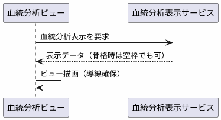

#### IPC 公開面

| 操作 | 引数（意味） | 戻り値（意味） |
|------|--------------|----------------|
| 血統分析表示 | 血統の参照 | 血統分析の表示データ |

#### 実装の位置づけ

UI 骨格。本実装は血統フェーズ。

---

### 5.9 手動更新実行（同期 → 分析）

#### 仕様

| 項目 | 内容 |
|------|------|
| 目的 | PostgreSQL → SQLite 同期のあと Domain 分析を実行し結果を永続化する |
| 事前条件 | PostgreSQL 接続設定が有効。SQLite パスが利用可能 |
| 入力 | 任意で強制再実行の指定（差分方針は DB 設計で確定） |
| 出力 | 受付結果（ジョブ識別・実行状態）。完了後は状態取得で詳細 |
| 副作用 | SQLite マスタ反映、分析結果反映、更新メタ更新。**PostgreSQL は読取のみ** |
| エラー | 接続失敗／同期失敗／分析失敗。部分適用の有無はログ＋ UI 通知（整合方針は DB 設計） |
| 非機能 | UI をブロックしない。進捗通知可 |
| 起動 | ホームまたは設定からの手動実行。起動時自動全更新は必須としない |

#### パイプライン段階とコンポーネント

| 段階 | モジュール | コンポーネント | 入力 | 出力 | 失敗時方針（要約） |
|------|------------|----------------|------|------|-------------------|
| 1. 同期 | 同期 | 同期オーケストレータ＋マスタ別同期プラグイン | PostgreSQL | SQLite マスタ | 中断・ロールバック方針は `DB_design.md` |
| 2. 分析 | 分析オーケストレータ | 分析オーケストレータ＋ドメイン分析プラグイン | SQLite マスタ | 分析結果の反映 | 同期成功後の失敗時整合は DB 設計へ委譲 |
| 3. メタ | 設定 | 更新メタ書込 | 件数・日時 | 設定／メタテーブル | 失敗してもログ必須 |

#### ドメイン分析プラグイン（共通境界）

| 項目 | 内容 |
|------|------|
| 入口 | 全件分析／対象指定分析 |
| 入力 | マスタ（SQLite 読取） |
| 出力 | 分析結果行（反映対象） |
| 無効化 | 設定フラグでスキップ可能（強さ／コスパは当面スキップ） |

| プラグイン | 対応 Domain | 当面 | 成果物（論理） |
|------------|-------------|------|----------------|
| 調教師分析プラグイン | 調教師分析 | **必須** | 勝率・連対率・複勝率、表示用整形、距離別・重賞一覧の分析行 |
| 牧場分析プラグイン | 牧場分析 | スキップ可 | 生産者集計行（後続） |
| 血統分析プラグイン | 血統分析 | スキップ可 | 適性・兄弟（後続） |
| 類似馬分析プラグイン | 類似馬 | 無効 | — |
| 強さ／コスパ分析プラグイン | 強さ／コスパ | 無効 | — |

#### 構成コンポーネント（ユースケース全体）

| 種別 | 名称 | 責務 |
|------|------|------|
| Presentation | 更新コントロール | 実行ボタン・進捗・結果サマリ |
| Application | 手動更新実行サービス | ジョブ起票、更新パイプライン起動、進捗購読の公開 |
| Pipeline | 更新パイプライン | 同期 → 分析 → メタ更新の順序制御 |
| Pipeline | 同期 | PostgreSQL 抽出・変換・反映 |
| Pipeline | 分析オーケストレータ | ドメイン分析プラグインの実行順 |
| Domain | 調教師分析（他は任意） | 指標算出 |
| Infrastructure | PG 接続／SQLite アクセス／設定 | 接続・書込・メタ |

UI 参照: [`UI/panels/update_control.md`](./UI/panels/update_control.md) / [`UI/panels/update_result.md`](./UI/panels/update_result.md)

#### フロー

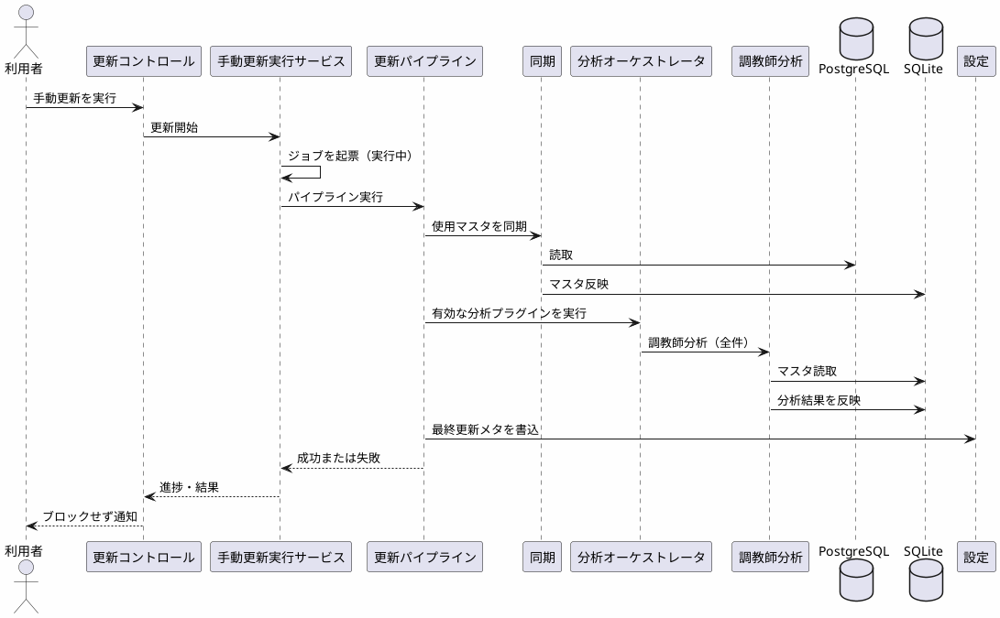

#### IPC 公開面

| 操作 | 引数（意味） | 戻り値（意味） |
|------|--------------|----------------|
| 手動更新実行 | 強制再実行の有無（任意） | ジョブ識別、実行状態 |
| 更新キャンセル（任意） | ジョブ識別 | キャンセル成否 ※要否は未決 |

#### 実装の位置づけ

同期（調教師関連）＋分析（調教師）は本実装。牧場／血統プラグインは後続で有効化。

---

### 5.10 更新状態取得

#### 仕様

| 項目 | 内容 |
|------|------|
| 目的 | 最終更新状態を返す（ホーム要約・設定詳細・実行中ジョブ） |
| 事前条件 | なし（未更新なら日時なし） |
| 入力 | なし、または実行中ジョブの識別 |
| 出力 | 最終成功日時、実行状態、件数要約、エラー要約、実行中ジョブの有無 |
| 副作用 | なし |
| エラー | メタ破損 → 警告＋再更新誘導 |

#### 構成コンポーネント

| 種別 | 名称 | 責務 |
|------|------|------|
| Presentation | 更新コントロール／ホーム（要約）／設定（詳細） | 状態表示 |
| Application | 更新状態取得サービス | メタ＋実行中ジョブの合成 |
| Infrastructure | 設定 | 永続メタ読取 |
| Application | 手動更新実行サービス（実行中のみ） | 実行中ジョブ状態 |

#### フロー

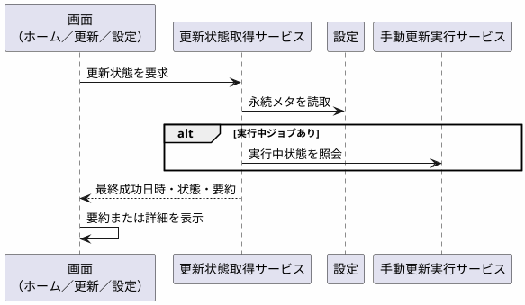

#### IPC 公開面

| 操作 | 引数（意味） | 戻り値（意味） |
|------|--------------|----------------|
| 更新状態取得 | ジョブ識別（任意） | 更新状態 |

#### 実装の位置づけ

本実装。

---

### 5.11 設定の読書き

#### 仕様

| 項目 | 内容 |
|------|------|
| 目的 | PostgreSQL 接続・SQLite パス等の設定読書き。更新詳細サマリの表示口 |
| 事前条件 | なし |
| 入力（読） | なし |
| 入力（書） | 設定の差分（接続要素、パス、機能フラグ等） |
| 出力（読） | 設定の表示データ |
| 出力（書） | 成否、または更新後の全設定 |
| 副作用 | ローカル設定の永続化。外部送信しない |
| エラー | 検証失敗（必須欠落・形式）。書込失敗 |

#### 構成コンポーネント

| 種別 | 名称 | 責務 |
|------|------|------|
| Presentation | 設定 | 設定フォーム・更新詳細 |
| Presentation | 接続パネル | PostgreSQL 接続 UX |
| Application | 設定サービス | 検証・読書き・秘密情報のマスク方針 |
| Infrastructure | 設定 | 永続化（ファイルまたは SQLite メタ） |

UI 参照: [`UI/settings.md`](./UI/settings.md) / [`UI/panels/connection.md`](./UI/panels/connection.md)

#### フロー

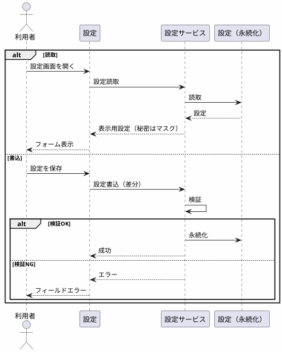

#### IPC 公開面

| 操作 | 引数（意味） | 戻り値（意味） |
|------|--------------|----------------|
| 設定読取 | なし | 設定の表示データ |
| 設定書込 | 設定の差分 | 成否、または更新後の全設定 |

#### 実装の位置づけ

接続・パス・最終更新表示・強さ／コスパ無効は本実装。

---

## 6. 共有コンポーネントカタログ

### 6.1 画面／ビュー級索引

| 名称 | 主ユースケース | 単体画面 | ダッシュ埋込 | UI 文書 |
|------|----------------|----------|--------------|---------|
| アプリシェル | （横断） | — | — | [`UI/shell.md`](./UI/shell.md) |
| ホーム | ホーム表示 | ✅ | — | [`UI/home.md`](./UI/home.md) |
| 募集馬入力 | 募集馬入力・フォーム保持 | ✅ | — | [`UI/panels/horse_entry.md`](./UI/panels/horse_entry.md) |
| 募集馬プロフィール | 募集馬情報表示 | — | ✅ | [`UI/panels/horse_profile.md`](./UI/panels/horse_profile.md) |
| 分析ダッシュボード | 分析ダッシュボード切替・埋め込み | — | ✅ | [`UI/analysis_dashboard.md`](./UI/analysis_dashboard.md) |
| 調教師検索 | 調教師名検索 | ✅ | — | [`UI/panels/trainer_search.md`](./UI/panels/trainer_search.md) |
| 調教師分析ビュー | 調教師分析表示 | ✅ | ✅ | [`UI/panels/trainer_analysis.md`](./UI/panels/trainer_analysis.md) |
| 牧場分析ビュー | 生産牧場分析表示 | 骨格 | 骨格 | [`UI/panels/farm.md`](./UI/panels/farm.md) |
| 血統分析ビュー | 血統分析表示 | 骨格 | 骨格 | [`UI/panels/pedigree.md`](./UI/panels/pedigree.md) |
| 更新コントロール | 手動更新実行／更新状態取得 | ✅ | — | [`UI/panels/update_control.md`](./UI/panels/update_control.md) |
| 設定 | 設定の読書き | ✅ | — | [`UI/settings.md`](./UI/settings.md) |

### 6.2 共有 UI 部品

詳細リストの正は [`UI/components.md`](./UI/components.md)。本書はユースケースからの参照名を固定する。

| 部品名 | 利用ユースケース例 | 備考 |
|--------|--------------------|------|
| エンティティ検索ボックス | 調教師名検索／募集馬入力 | 候補選択 |
| 指標表 | 調教師分析表示 他 | 賞金・着回表 |
| 率表示 | 調教師分析表示 | 勝率・連対・複勝 |
| 棒グラフ | 調教師分析表示 | 距離別等 |
| エラーバナー | 全ユースケース | 更新失敗・DB エラー |
| 空状態 | 表示系 | 未更新・結果なし |
| ナビカード | ホーム表示 | 入口カード |
| 分析種類セレクタ | 分析ダッシュボード切替 | 分析種類切替 |

### 6.3 データ論理グループ（概要）

物理定義は `DB_design.md`。所有関係のみ。

| 論理グループ | 書込主 | 読取主ユースケース |
|--------------|--------|--------------------|
| マスタ・スナップショット | 同期（手動更新実行） | 検索・分析・表示の補完 |
| 分析結果 | 分析オーケストレータ＋Domain 各分析 | 調教師分析表示 他（表示） |
| アプリメタ・設定 | 設定 | ホーム表示／更新状態取得／設定の読書き |
| 募集馬（将来） | 後続の保存処理 | 募集馬情報表示 等 |

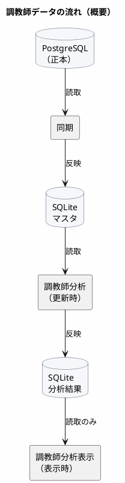

---

## 7. パッケージ構成と依存ルール

### 7.1 ディレクトリ対応

| パス | 対応 | 備考 |
|------|------|------|
| `apps/web` | Presentation（画面／ビュー） | 開発の主戦場 |
| `apps/desktop` | Tauri Shell | Tauri 後付け |
| `packages/app-core` | Application（各サービス＝ユースケース） | ユースケース境界の実装 |
| `packages/domain` または `analysis` | Domain 各分析／分析オーケストレータ | 分析プラグイン |
| `packages/sync` | 同期 | PostgreSQL → SQLite |
| `packages/db` | SQLite アクセス（スキーマ・リポジトリ） | マスタ＋分析結果 |
| （設定モジュール） | 設定 | app-core 内でも可 |

### 7.2 依存ルール（強制）

| ルール | 内容 |
|--------|------|
| 1 | Presentation は Domain／Infrastructure を直接参照しない。Application（ユースケース）のみ |
| 2 | Domain は UI・Tauri・PostgreSQL クライアントに依存しない |
| 3 | 同期は分析を呼ばない（更新パイプラインが順序を制御） |
| 4 | 表示系ユースケースは Domain の算出処理を呼ばない（分析結果の読取のみ） |
| 5 | 同一分析ビューを単体画面とダッシュボードで共有する |

---

## 8. 外部 IF・IPC 仕様

HTTP は定義しない。**公開操作＝ユースケースの公開面**。

### 8.1 開発時

| 呼び出し方 | 内容 |
|------------|------|
| 同一プロセス | Presentation → Application のサービスを直接呼ぶ |
| 開発用ホスト | 一時的。製品では IPC に置換（アーキ §5.1） |

### 8.2 製品時（公開操作）一覧

| 操作 | ユースケース | 引数（意味） | 戻り値（意味） |
|------|--------------|--------------|----------------|
| ホーム表示 | ホーム表示 | なし | ナビ先、更新要約 |
| 募集馬候補検索 | 募集馬入力 | 対象項目、検索文字列 | 候補一覧 |
| 募集馬フォーム検証 | 募集馬入力 | フォーム状態 | 成否、エラー |
| ダッシュボード切替 | 分析ダッシュボード切替 | 分析種類、コンテキスト | 埋め込み用表示データ（任意） |
| 募集馬情報表示 | 募集馬情報表示 | フォーム状態 | プロフィール表示データ |
| 調教師名検索 | 調教師名検索 | 検索文字列 | 候補一覧 |
| 調教師分析表示 | 調教師分析表示 | 調教師の識別子 | 分析表示データ |
| 生産牧場分析表示 | 生産牧場分析表示 | 生産者の識別子 | 分析表示データ |
| 血統分析表示 | 血統分析表示 | 血統の参照 | 分析表示データ |
| 手動更新実行 | 手動更新実行 | 強制再実行の有無（任意） | ジョブ識別、状態 |
| 更新状態取得 | 更新状態取得 | ジョブ識別（任意） | 状態 |
| 設定読取 | 設定の読書き | なし | 設定 |
| 設定書込 | 設定の読書き | 設定の差分 | 成否 |

### 8.3 外部システム

| 相手 | 方向 | 仕様の置き場 |
|------|------|--------------|
| PostgreSQL | 読取（同期時） | 接続設定 + `DB_design.md` |
| SQLite | 読書き | `DB_design.md` |
| クラブサイト等 | 接続しない | — |

---

## 9. エラー・状態・ログ規約

| 種別 | 方針 | UI 表現 | 主なユースケース |
|------|------|---------|------------------|
| 検証エラー | フォーム内 | フィールドメッセージ | 募集馬入力／設定の読書き |
| データなし | 正常系の一種 | 空状態 | 表示系 |
| 未更新（分析結果なし） | 誘導 | 空状態＋更新への誘導 | 調教師分析表示 他 |
| 更新失敗 | パイプライン | エラーバナー＋ログ | 手動更新実行 |
| DB 未初期化 | ブロッキング寄り | 設定／更新へ誘導 | ホーム表示／検索 |

| 項目 | 内容 |
|------|------|
| ログレベル | エラー／警告／情報（詳細は開発時） |
| 個人情報 | PostgreSQL 接続情報をログに出さない |
| 相関 | 更新ジョブの識別を進捗・エラーに付与 |

---

## 10. 設定項目

| 項目（論理） | 意味 | 既定 | 保存先 |
|--------------|------|------|--------|
| PostgreSQL 接続 | 正本 DB への接続 | 未設定 | ローカル設定（外部送信しない） |
| SQLite パス | アプリ DB ファイル | OS 慣例（詳細は DB 設計） | ローカル設定 |
| 最終更新成功日時 | 最後に成功した更新時刻 | なし | メタ |
| 最終更新件数要約 | 件数の要約 | なし | メタ |
| 強さ／コスパ分析の有効化 | 更新時分析に含めるか | 無効 | 設定 |
| 類似馬分析の有効化 | 更新時分析に含めるか | 無効 | 設定 |
| ダッシュボード初期分析種類 | 初期表示の分析種類 | 固定（ユーザー設定は後続） | 当面はコード定数 |

---

## 11. 実装フェーズ対応

| フェーズ | 含めるユースケース／モジュール | 含めない・後回し |
|----------|--------------------------------|------------------|
| 調教師貫通（中心） | ホーム表示、調教師名検索、調教師分析表示、ダッシュボード（調教師埋込）、手動更新実行／状態取得、設定の読書き、調教師分析 Domain、同期（調教師系） | スコア、複数頭、募集馬永続化 |
| 募集馬フロー | 募集馬入力、募集馬情報表示、ダッシュボード切替 | 保存処理 |
| UI 骨格 | 生産牧場分析表示、血統分析表示 | Domain 本実装 |
| 後続 | 牧場／血統 Domain 本実装、募集馬永続化 | |
| PoC 後 | 類似馬／強さ・コスパ、総合評価表示 | |
| 製品化 | Tauri Shell（IPC） | 開発用ホスト |

---

## 12. 未決事項・委譲

| 項目 | 状態 | 委譲先 |
|------|------|--------|
| SQLite 物理スキーマ・インデックス | 未決 | `DB_design.md` |
| 同期成功後・分析失敗時の整合 | 未決 | `DB_design.md` |
| PostgreSQL 定義書とのカラムマッピング | 未決 | `DB_design.md` |
| 更新キャンセルの要否 | 未決 | 実装時／本書 §5.9 |
| Tauri から TypeScript ユースケースを呼ぶ方式 | 未決 | 実装時（アーキ §9） |
| チャートライブラリ最終選定 | 未決 | 実装時 |
| 距離帯境界値 | 未決 | 血統本実装時 |
| 強さ／コスパ式・類似馬定義 | 未定 | PoC |
| デザイントークン具体値 | UI 側 | [`UI/visual.md`](./UI/visual.md) |

---

## 13. 変更履歴

| 日付 | 変更 | 著者 |
|------|------|------|
| 2026-08-09 | テンプレート／アウトライン初版 | — |
| 2026-08-09 | 全面改訂。アーキ §4 ユースケース単位でコンポーネント設計・入出力仕様・IPC を記入 | — |
| 2026-08-09 | 「契約」を「仕様」に用語統一 | — |
| 2026-08-09 | 設計 ID 表記を廃止し名称ベースに統一 | — |
| 2026-08-09 | 一覧のフェーズ列削除。関数・変数名を排除。図を PlantUML に統一 | — |
